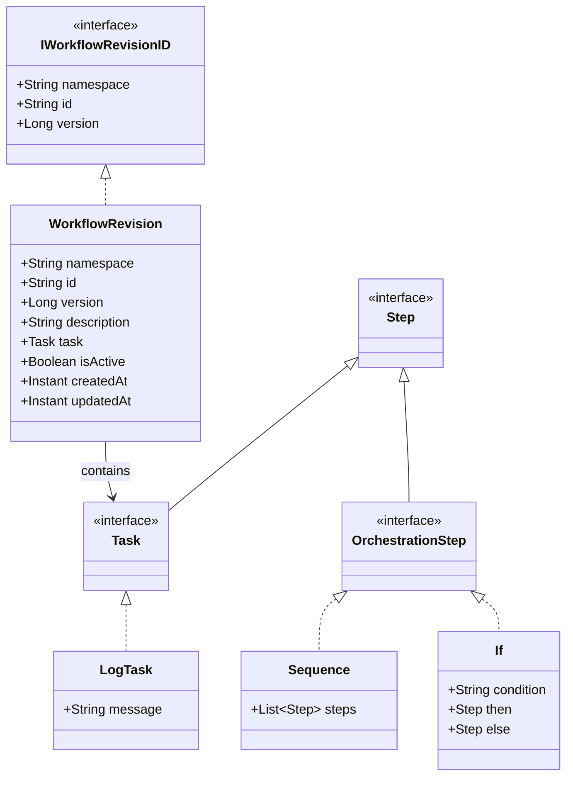
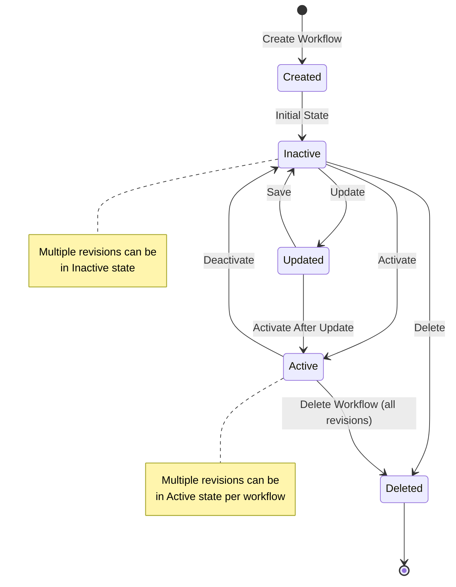
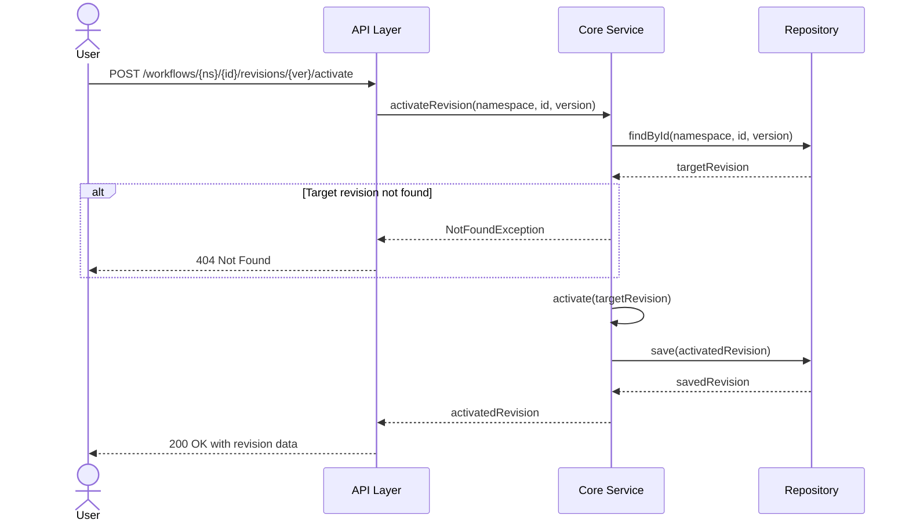

# Workflow Management Feature Specification

## 1. Feature Overview

### Feature Name
Workflow Management - Lifecycle Operations

### Status
Draft

### Priority
Critical

### Target Release
Version 1.0

### Summary
The Workflow Management feature provides complete lifecycle management capabilities for workflows and their revisions in the Maestro orchestration system. It enables users to create workflows, manage multiple revisions, control activation state, and maintain workflow versioning with full CRUD operations. This feature serves as the foundation for all workflow orchestration capabilities in Maestro.

**Important**: Workflow revisions are provided in YAML which is parsed and validated by the API layer before persistence. The parsed YAML structure is stored internally in the database as JSON. This allows for flexible workflow definition formats and allows for complex orchestration logic with nested steps. The YAML format must also be persisted in the database for future reference. Thus, when retrieving a revision, the comments and formatting in the YAML definition are preserved.

## 2. User Stories

### 2.1 Workflow Creation

**As a** workflow designer,
**I want to** create a new workflow with its first revision,
**So that** I can begin defining orchestration logic for my dataflow processes.

**Acceptance Criteria:**
- Given I provide a unique workflow ID, namespace, description, and task definition
- When I create a new workflow
- Then the system creates a workflow with version 1
- And the new revision is marked as inactive by default
- And the system returns the created workflow revision with all metadata
- And the workflow ID and namespace combination must be unique across the system

### 2.2 New Revision Creation

**As a** workflow designer,
**I want to** create a new revision of an existing workflow,
**So that** I can evolve my workflow logic while maintaining version history.

**Acceptance Criteria:**
- Given an existing workflow with one or more revisions
- When I create a new revision with updated task definitions
- Then the system creates a new revision with version number incremented by 1
- And the new revision is marked as inactive by default
- And all existing revisions remain unchanged
- And I cannot skip version numbers (revisions must be sequential)
- And the system returns the newly created revision

### 2.3 Revision Update

**As a** workflow designer,
**I want to** update an inactive workflow revision,
**So that** I can refine my workflow definition before activating it.

**Acceptance Criteria:**
- Given an existing workflow revision that is inactive
- When I update the revision with new description or task definitions
- Then the system updates the revision in place
- And the version number remains unchanged
- And the system updates the updatedAt timestamp
- And I cannot update an active revision (must deactivate first)
- And the system returns the updated revision

### 2.4 Revision Activation State Management

**As a** workflow operator,
**I want to** activate or deactivate workflow revisions,
**So that** I can control which version of a workflow is used for execution.

**Acceptance Criteria:**

**Activation:**
- Given an inactive workflow revision
- When I activate the revision
- Then the system marks the revision as active
- And multiple revisions of the same workflow (namespace + id) can be active simultaneously
- And the system returns the activated revision

**Deactivation:**
- Given an active workflow revision
- When I deactivate the revision
- Then the system marks the revision as inactive
- And the revision remains in the system for historical reference
- And the system returns the deactivated revision

### 2.5 Revision Deletion

**As a** workflow designer,
**I want to** delete a specific workflow revision,
**So that** I can remove experimental or obsolete versions while preserving other revisions.

**Acceptance Criteria:**
- Given an inactive workflow revision
- When I delete the revision
- Then the system permanently removes the revision from storage
- And other revisions of the same workflow remain unchanged
- And I cannot delete an active revision (must deactivate first)
- And the system returns a success confirmation
- And deleted version numbers are not reused

### 2.6 Workflow Deletion

**As a** workflow administrator,
**I want to** delete an entire workflow with all its revisions,
**So that** I can completely remove workflows that are no longer needed.

**Acceptance Criteria:**
- Given a workflow identified by namespace and ID
- When I delete the workflow
- Then the system removes all revisions of the workflow (regardless of active state)
- And the deletion is permanent and cannot be undone
- And the system returns a success confirmation with the count of deleted revisions
- And the namespace and ID can be reused for new workflows after deletion

## 3. Functional Requirements

### 3.1 Workflow Creation (REQ-WF-001 to REQ-WF-007)

**REQ-WF-001**: The system shall create a new workflow revision when provided with namespace, id, description, and step definition.

**REQ-WF-002**: The system shall assign version number 1 to the first revision of a workflow.

**REQ-WF-003**: The system shall set isActive to false by default for newly created revisions.

**REQ-WF-004**: The system shall validate that the combination of namespace and id is unique for version 1 revisions.

**REQ-WF-005**: The system shall set both createdAt and updatedAt timestamps to the current time upon creation.

**REQ-WF-006**: The system shall validate that the task definition is a valid Step implementation.

**REQ-WF-007**: The system shall persist the workflow revision to the repository and return the created entity.

### 3.2 New Revision Creation (REQ-WF-008 to REQ-WF-015)

**REQ-WF-008**: The system shall accept namespace, id, description, and task definition to create a new revision.

**REQ-WF-009**: The system shall verify that at least one revision exists for the specified namespace and id.

**REQ-WF-010**: The system shall query the maximum version number for the workflow.

**REQ-WF-011**: The system shall assign the next sequential version number (maxVersion + 1) to the new revision.

**REQ-WF-012**: The system shall set isActive to false by default for new revisions.

**REQ-WF-013**: The system shall set createdAt to the current time and updatedAt to the current time.

**REQ-WF-014**: The system shall validate that the task definition is a valid Step implementation.

**REQ-WF-015**: The system shall persist the new revision and return the created entity.

### 3.3 Revision Update (REQ-WF-016 to REQ-WF-023)

**REQ-WF-016**: The system shall accept namespace, id, version, and optional fields (description, task) for updates.

**REQ-WF-017**: The system shall verify that the specified revision exists.

**REQ-WF-018**: The system shall verify that the revision is not active before allowing updates.

**REQ-WF-019**: The system shall update only the provided fields (description and/or task).

**REQ-WF-020**: The system shall not modify the version number, namespace, id, createdAt, or isActive fields.

**REQ-WF-021**: The system shall update the updatedAt timestamp to the current time.

**REQ-WF-022**: The system shall validate any updated task definition is a valid Step implementation.

**REQ-WF-023**: The system shall persist the changes and return the updated revision.

### 3.4 Revision Activation (REQ-WF-024 to REQ-WF-030)

**REQ-WF-024**: The system shall accept namespace, id, and version to activate a revision.

**REQ-WF-025**: The system shall verify that the specified revision exists.

**REQ-WF-026**: The system shall query for all currently active revisions with the same namespace and id.

**REQ-WF-027**: The system shall allow multiple revisions to be active simultaneously for the same workflow (namespace + id).

**REQ-WF-028**: The system shall set isActive to true for the target revision.

**REQ-WF-029**: The system shall update the updatedAt timestamp for the activated revision.

**REQ-WF-030**: The system shall persist the state changes and return the activated revision.

### 3.5 Revision Deactivation (REQ-WF-031 to REQ-WF-035)

**REQ-WF-031**: The system shall accept namespace, id, and version to deactivate a revision.

**REQ-WF-032**: The system shall verify that the specified revision exists.

**REQ-WF-033**: The system shall set isActive to false for the revision.

**REQ-WF-034**: The system shall update the updatedAt timestamp to the current time.

**REQ-WF-035**: The system shall persist the state change and return the deactivated revision.

### 3.6 Revision Deletion (REQ-WF-036 to REQ-WF-041)

**REQ-WF-036**: The system shall accept namespace, id, and version to delete a specific revision.

**REQ-WF-037**: The system shall verify that the specified revision exists.

**REQ-WF-038**: The system shall verify that the revision is not active before allowing deletion.

**REQ-WF-039**: The system shall permanently remove the revision from the repository.

**REQ-WF-040**: The system shall not reuse deleted version numbers for the same workflow, unless the deleted revision is the last active revision.

**REQ-WF-041**: The system shall return a success confirmation indicating the revision was deleted.

### 3.7 Workflow Deletion (REQ-WF-042 to REQ-WF-046)

**REQ-WF-042**: The system shall accept namespace and id to delete all revisions of a workflow.

**REQ-WF-043**: The system shall query all revisions matching the namespace and id.

**REQ-WF-044**: The system shall delete all revisions regardless of their active state.

**REQ-WF-045**: The system shall perform the deletion in a single atomic operation when possible.

**REQ-WF-046**: The system shall return a success confirmation with the count of deleted revisions.

### 3.8 Data Validation Requirements (REQ-WF-047 to REQ-WF-058)

**REQ-WF-047**: The system shall validate that namespace is not null, not blank, and follows naming conventions (alphanumeric, hyphens, underscores, max 100 characters).

**REQ-WF-048**: The system shall validate that id is not null, not blank, and follows naming conventions (alphanumeric, hyphens, underscores, max 100 characters).

**REQ-WF-049**: The system shall validate that version is a positive long integer (version > 0).

**REQ-WF-050**: The system shall validate that description is not null and does not exceed 1000 characters.

**REQ-WF-051**: The system shall validate that task is not null and is a valid implementation of the Task interface.

**REQ-WF-052**: The system shall validate that createdAt and updatedAt are valid timestamps.

**REQ-WF-053**: The system shall reject requests with invalid JSON structure or missing required fields.

**REQ-WF-054**: The system shall perform task definition validation to ensure it contains valid Step implementations.

**REQ-WF-055**: The system shall validate that nested tasks in orchestration steps (Sequence, If) are valid.

**REQ-WF-056**: The system shall accept workflow definitions in YAML format and parse them into the internal Step model.

**REQ-WF-057**: The system shall validate YAML syntax and reject malformed YAML with clear error messages indicating the parsing error.

**REQ-WF-058**: The system shall reject YAML definitions containing unknown step types or invalid step configurations.

## 4. API Contract

### 4.0 Input Format: YAML Workflow Definitions

**Primary Input Format**: Workflow revisions MUST be provided in **YAML format**. The YAML structure defines the workflow steps using a declarative syntax that is parsed and converted to the internal Step model.

**YAML Structure**:
```yaml
namespace: production
id: payment-processing
name: Payment Processing
description: Handles payment processing workflow with retry logic
steps:
  - type: Sequence
    steps:
      - type: LogTask
        message: "Starting payment processing"
      - type: If
        condition: "amount > 1000"
        then:
          type: Task
          name: "manual-approval"
        else:
          type: Task
          name: "auto-process"
      - type: LogTask
        message: "Payment processing completed"
```

**Key Points**:
- The `steps` field contains the workflow definition in YAML
- YAML is parsed by the API layer and validated before persistence
- The parsed YAML is converted to the internal Step hierarchy (Sequence, If, Task, LogTask, etc.)
- Invalid YAML structure or unknown step types will result in validation errors
- The system stores the parsed Step structure internally (typically as JSON in the database)

**Benefits of YAML Input**:
- Human-readable and easy to edit
- Supports comments for documentation
- Less verbose than JSON
- Better suited for complex nested structures
- Industry standard for workflow/pipeline definitions

### 4.1 REST Endpoints

#### 4.1.1 Create Workflow (First Revision)

**Endpoint**: `POST /api/workflows`

**Request Body**:
```yaml
namespace: "production"
id: "payment-processing"
name: "Payment Processing"
active: true
description: "Handles payment processing workflow"
steps:
  - type: "Sequence"
    steps:
      - type: "LogTask",
        message: "Starting payment processing"
```
The version number is automatically assigned by the system and is set to 1 and can be omitted from the request body.

**Success Response**: `201 Created`
```yaml
namespace: "production"
id: "payment-processing"
name: "Payment Processing"
version: 1
active: true
description: "Handles payment processing workflow"
steps: [ ... ]
createdAt: "2025-01-16T14:20:00Z"
updatedAt: "2025-01-16T14:20:00Z"
```

**Error Responses**:
- `400 Bad Request`: Invalid input data or validation failure
- `409 Conflict`: Workflow with this namespace and id already exists
- `500 Internal Server Error`: System error

#### 4.1.2 Create New Revision

**Endpoint**: `POST /api/workflows/{namespace}/{id}`

**Request Body**:
```yaml
description: "Updated payment processing with retry logic"
steps: 
  - type: "Sequence"
    steps: [ ... ]
```
The version number is automatically assigned by the system and is incremented by 1 from the previous revision. The version can be omitted from the request body.
The namespace and id must match the existing workflow if they are specified but they can be omitted from the request body.

**Success Response**: `201 Created`
```yaml
namespace: "production"
id: "payment-processing"
name: "Payment Processing"
version: 2
description: "Updated payment processing with retry logic"
steps: [ ... ]
active: true
createdAt: "2025-01-16T14:20:00Z"
updatedAt: "2025-01-16T14:20:00Z"
```

**Error Responses**:
- `400 Bad Request`: Invalid input data
- `404 Not Found`: Workflow not found
- `500 Internal Server Error`: System error

#### 4.1.3 Update Revision

**Endpoint**: `PUT /api/workflows/{namespace}/{id}/{version}`

**Request Body** (partial update supported):
```yaml
description": "Updated description"
steps: [ ... ]
```

**Success Response**: `200 OK`
```yaml
namespace: "production"
id: "payment-processing"
name: "Payment Processing"
version: 2
description: "Updated description"
steps: [ ... ]
active: true
createdAt: "2025-01-16T14:20:00Z"
updatedAt: "2025-01-16T14:20:00Z"
```

**Error Responses**:
- `400 Bad Request`: Invalid input data
- `404 Not Found`: Revision not found
- `409 Conflict`: Cannot update active revision
- `500 Internal Server Error`: System error

#### 4.1.4 Activate Revision

**Endpoint**: `POST /api/workflows/{namespace}/{id}/{version}/activate`

**Request Body**: None

**Success Response**: `200 OK`
```yaml
namespace: "production"
id: "payment-processing"
name: "Payment Processing"
version: 2
description: "Updated description"
steps: [ ... ]
active: true
createdAt: "2025-01-16T14:20:00Z"
updatedAt: "2025-01-16T14:20:00Z"
```

**Error Responses**:
- `404 Not Found`: Revision not found
- `500 Internal Server Error`: System error

#### 4.1.5 Deactivate Revision

**Endpoint**: `POST /api/workflows/{namespace}/{id}/{version}/deactivate`

**Request Body**: None

**Success Response**: `200 OK`
```yaml
namespace: "production"
id: "payment-processing"
name: "Payment Processing"
version: 2
description: "Updated description"
steps: [ ... ]
active: false
createdAt: "2025-01-16T14:20:00Z"
updatedAt: "2025-01-16T14:20:00Z"
```

**Error Responses**:
- `404 Not Found`: Revision not found
- `500 Internal Server Error`: System error

#### 4.1.6 Delete Revision

**Endpoint**: `DELETE /api/workflows/{namespace}/{id}/{version}`

**Request Body**: None

**Success Response**: `204 No Content`

**Error Responses**:
- `404 Not Found`: Revision not found
- `409 Conflict`: Cannot delete active revision
- `500 Internal Server Error`: System error

#### 4.1.7 Delete Workflow

**Endpoint**: `DELETE /api/workflows/{namespace}/{id}`

**Request Body**: None

**Success Response**: `200 OK`
```json
{
  "message": "Workflow deleted successfully",
  "namespace": "production",
  "id": "payment-processing",
  "deletedRevisions": 3
}
```

**Error Responses**:
- `404 Not Found`: Workflow not found
- `500 Internal Server Error`: System error

#### 4.1.8 Query Endpoints (Supporting Operations)

**Get Specific Revision**:
`GET /api/workflows/{namespace}/{id}/{version}`

**List All Revisions of a Workflow**:
`GET /api/workflows/{namespace}/{id}`

**Get Active Revisions**:
`GET /api/workflows/{namespace}/{id}?active=true`
- Returns a list of all currently active revisions for the specified workflow

**List All Workflows**:
`GET /api/workflows?namespace={namespace}`

### 4.2 Error Response Format

All error responses follow a consistent structure:

```json
{
  "timestamp": "2025-01-15T10:30:00Z",
  "status": 400,
  "error": "Bad Request",
  "message": "Description cannot be blank",
  "path": "/api/workflows",
  "validationErrors": [
    {
      "field": "description",
      "message": "must not be blank"
    }
  ]
}
```

## 5. Business Rules

### 5.1 Versioning Rules

**BR-001**: Version numbers must start at 1 for the first revision of a workflow.

**BR-002**: Version numbers must be sequential and increment by 1 for each new revision.

**BR-003**: Version numbers cannot be skipped (e.g., cannot create version 3 if version 2 doesn't exist).

**BR-004**: Version numbers are immutable once assigned and cannot be changed.

**BR-005**: Deleted version numbers are not reused for the same workflow.

### 5.2 Activation Rules

**BR-006**: Multiple revisions per workflow (identified by namespace + id) can be active simultaneously.

**BR-007**: When a revision is activated, previously active revisions of the same workflow remain active unless explicitly deactivated.

**BR-008**: New revisions are created with isActive = false by default.

**BR-009**: A workflow can have zero or more active revisions (multiple revisions can be active, or all can be inactive).

**BR-010**: Deactivating a revision does not delete it; it remains available for reference.

**Rationale for Multiple Active Revisions**:
Supporting multiple active revisions simultaneously provides several key benefits:
- **Gradual Rollout**: Enables canary deployments where new workflow versions can be tested with a subset of executions while maintaining the stable version
- **A/B Testing**: Allows running different workflow versions in parallel to compare performance, behavior, or business outcomes
- **Version Migration**: Facilitates safe migration between versions by allowing both old and new versions to run simultaneously during transition periods
- **Context-Based Execution**: Different execution contexts (e.g., regions, customer segments, priority levels) can use different active versions
- **Zero-Downtime Updates**: New versions can be activated before old versions are deactivated, ensuring continuous availability

### 5.3 Update and Deletion Rules

**BR-011**: Active revisions cannot be updated directly; they must be deactivated first.

**BR-012**: Active revisions cannot be deleted directly; they must be deactivated first.

**BR-013**: Inactive revisions can be freely updated without affecting other revisions.

**BR-014**: Deleting a single revision does not affect other revisions of the same workflow.

**BR-015**: Deleting a workflow removes all its revisions, regardless of active state.

### 5.4 Uniqueness and Identity Rules

**BR-016**: The combination of namespace, id, and version uniquely identifies a workflow revision.

**BR-017**: The combination of namespace and id identifies a workflow across all its revisions.

**BR-018**: Multiple workflows can have the same id if they have different namespaces.

**BR-019**: After a workflow is completely deleted, the same namespace and id can be reused for a new workflow.

**BR-020**: Namespaces provide logical isolation between different environments or domains.

### 5.5 Data Integrity Rules

**BR-021**: All timestamps (createdAt, updatedAt) must be in UTC.

**BR-022**: The createdAt timestamp is immutable after creation.

**BR-023**: The updatedAt timestamp is updated on every modification (including activation/deactivation).

**BR-024**: Task definitions must be valid Step implementations as defined in the model.

**BR-025**: Orphaned revisions (revisions without a parent workflow) are not allowed.

## 6. Edge Cases and Error Handling

### 6.1 Workflow Creation Edge Cases

**EC-001: Duplicate Workflow Creation**
- **Scenario**: Attempt to create a workflow with namespace and id that already exists
- **Expected Behavior**: Return 409 Conflict error
- **Error Message**: "Workflow with namespace '{namespace}' and id '{id}' already exists"

**EC-002: Invalid Task Definition**
- **Scenario**: Provide a task definition that doesn't conform to Step interface
- **Expected Behavior**: Return 400 Bad Request error
- **Error Message**: "Invalid task definition: {specific validation error}"

**EC-003: Empty or Null Namespace/ID**
- **Scenario**: Submit request with blank namespace or id
- **Expected Behavior**: Return 400 Bad Request error
- **Error Message**: "Namespace and id must not be blank"

**EC-004: Special Characters in Namespace/ID**
- **Scenario**: Use invalid characters in namespace or id (e.g., spaces, special symbols)
- **Expected Behavior**: Return 400 Bad Request error
- **Error Message**: "Namespace and id must contain only alphanumeric characters, hyphens, and underscores"

**EC-005: Extremely Long Description**
- **Scenario**: Provide description exceeding 1000 characters
- **Expected Behavior**: Return 400 Bad Request error
- **Error Message**: "Description must not exceed 1000 characters"

### 6.2 New Revision Creation Edge Cases

**EC-006: Non-Existent Workflow**
- **Scenario**: Create revision for workflow that doesn't exist
- **Expected Behavior**: Return 404 Not Found error
- **Error Message**: "Workflow with namespace '{namespace}' and id '{id}' not found"

**EC-007: Concurrent Revision Creation**
- **Scenario**: Two requests attempt to create a new revision simultaneously
- **Expected Behavior**: One succeeds with version N+1, the other should retry or fail with 409 Conflict
- **Error Message**: "Conflict creating revision: version already exists. Please retry."

**EC-008: Large Version Numbers**
- **Scenario**: Workflow with hundreds or thousands of revisions
- **Expected Behavior**: System continues to increment version normally
- **Note**: No upper limit on version numbers (Long type supports very large values)

### 6.3 Revision Update Edge Cases

**EC-009: Update Active Revision**
- **Scenario**: Attempt to update a revision that is currently active
- **Expected Behavior**: Return 409 Conflict error
- **Error Message**: "Cannot update active revision. Please deactivate it first."

**EC-010: Update Non-Existent Revision**
- **Scenario**: Attempt to update a revision that doesn't exist
- **Expected Behavior**: Return 404 Not Found error
- **Error Message**: "Revision {version} of workflow '{namespace}/{id}' not found"

**EC-011: Partial Update with Invalid Data**
- **Scenario**: Update only description but provide invalid task in the same request
- **Expected Behavior**: Return 400 Bad Request error, no fields are updated
- **Error Message**: "Invalid task definition: {specific error}"

**EC-012: Empty Update Request**
- **Scenario**: Send update request with no fields to update
- **Expected Behavior**: Return 400 Bad Request error
- **Error Message**: "At least one field (description or task) must be provided for update"

**EC-013: Update Deleted Revision**
- **Scenario**: Attempt to update a revision that was previously deleted
- **Expected Behavior**: Return 404 Not Found error
- **Error Message**: "Revision {version} of workflow '{namespace}/{id}' not found"

### 6.4 Activation/Deactivation Edge Cases

**EC-014: Activate Already Active Revision**
- **Scenario**: Activate a revision that is already active
- **Expected Behavior**: Operation succeeds idempotently, no state changes made
- **Response**: Return 200 OK with current revision state

**EC-015: Deactivate Already Inactive Revision**
- **Scenario**: Deactivate a revision that is already inactive
- **Expected Behavior**: Operation succeeds idempotently, no changes made
- **Response**: Return 200 OK with current revision state

**EC-016: Activate Non-Existent Revision**
- **Scenario**: Attempt to activate a revision that doesn't exist
- **Expected Behavior**: Return 404 Not Found error
- **Error Message**: "Revision {version} of workflow '{namespace}/{id}' not found"

**EC-017: Concurrent Activation Requests**
- **Scenario**: Two requests attempt to activate different revisions of the same workflow simultaneously
- **Expected Behavior**: Both activations succeed; multiple revisions become active
- **Note**: System allows multiple revisions to be active simultaneously after both operations complete

**EC-018: Activation During Execution**
- **Scenario**: Activate a different revision while another active revision is being executed
- **Expected Behavior**: Activation succeeds immediately; running executions complete with their original revision
- **Note**: Multiple active revisions can be executing simultaneously; execution context determines which version is used

### 6.5 Revision Deletion Edge Cases

**EC-019: Delete Active Revision**
- **Scenario**: Attempt to delete the currently active revision
- **Expected Behavior**: Return 409 Conflict error
- **Error Message**: "Cannot delete active revision. Please deactivate it first."

**EC-020: Delete Non-Existent Revision**
- **Scenario**: Attempt to delete a revision that doesn't exist
- **Expected Behavior**: Return 404 Not Found error
- **Error Message**: "Revision {version} of workflow '{namespace}/{id}' not found"

**EC-021: Delete Last Remaining Revision**
- **Scenario**: Delete the only remaining revision of a workflow
- **Expected Behavior**: Deletion succeeds; workflow effectively has no revisions (logically deleted)
- **Note**: Workflow metadata may remain depending on implementation

**EC-022: Concurrent Deletion Requests**
- **Scenario**: Two requests attempt to delete the same revision simultaneously
- **Expected Behavior**: One succeeds with 204, the other returns 404 Not Found

### 6.6 Workflow Deletion Edge Cases

**EC-023: Delete Non-Existent Workflow**
- **Scenario**: Attempt to delete a workflow that doesn't exist
- **Expected Behavior**: Return 404 Not Found error
- **Error Message**: "Workflow with namespace '{namespace}' and id '{id}' not found"

**EC-024: Delete Workflow with Active Revision**
- **Scenario**: Delete a workflow that has an active revision
- **Expected Behavior**: Deletion succeeds; all revisions including active ones are deleted
- **Response**: 200 OK with count of deleted revisions

**EC-025: Delete Workflow During Execution**
- **Scenario**: Delete a workflow while one of its revisions is being executed
- **Expected Behavior**: Deletion succeeds; running executions may fail or complete depending on execution model
- **Note**: Consider adding protection or warnings for this scenario

**EC-026: Concurrent Workflow Deletion**
- **Scenario**: Two requests attempt to delete the same workflow simultaneously
- **Expected Behavior**: One succeeds with 200 OK, the other returns 404 Not Found

**EC-027: Workflow with Many Revisions**
- **Scenario**: Delete a workflow with hundreds of revisions
- **Expected Behavior**: System deletes all revisions, may take longer but should succeed
- **Response**: Return count of all deleted revisions

### 6.7 Validation Edge Cases

**EC-028: Malformed JSON**
- **Scenario**: Submit request with invalid JSON syntax
- **Expected Behavior**: Return 400 Bad Request error
- **Error Message**: "Malformed JSON: {parsing error}"

**EC-029: Missing Required Fields**
- **Scenario**: Submit request missing required fields (e.g., no task definition)
- **Expected Behavior**: Return 400 Bad Request error with list of missing fields
- **Error Message**: "Missing required fields: task"

**EC-030: Type Mismatch**
- **Scenario**: Provide wrong type for a field (e.g., string for version number)
- **Expected Behavior**: Return 400 Bad Request error
- **Error Message**: "Invalid type for field 'version': expected number, got string"

**EC-031: Null Values in Required Fields**
- **Scenario**: Explicitly set required fields to null
- **Expected Behavior**: Return 400 Bad Request error
- **Error Message**: "Field '{field}' must not be null"

**EC-032: Deeply Nested Task Definitions**
- **Scenario**: Task definition with many levels of nested orchestration steps
- **Expected Behavior**: Validate entire tree structure; reject if any nested step is invalid
- **Note**: Consider setting a maximum nesting depth to prevent stack overflow

**EC-033: Malformed YAML**
- **Scenario**: Submit workflow definition with invalid YAML syntax (e.g., incorrect indentation, missing colons)
- **Expected Behavior**: Return 400 Bad Request error
- **Error Message**: "Invalid YAML syntax: {specific parsing error with line/column information}"

**EC-034: Unknown Step Types in YAML**
- **Scenario**: Provide YAML with step types that don't exist in the Step model
- **Expected Behavior**: Return 400 Bad Request error
- **Error Message**: "Unknown step type '{type}' in workflow definition"

## 7. Non-Functional Requirements

### 7.1 Performance

**NFR-001**: Workflow creation operations shall complete within 500ms under normal load (p95).

**NFR-002**: Revision query operations shall complete within 200ms under normal load (p95).

**NFR-003**: Update and activation operations shall complete within 300ms under normal load (p95).

**NFR-004**: Deletion of individual revisions shall complete within 500ms under normal load (p95).

**NFR-005**: Workflow deletion with up to 100 revisions shall complete within 2 seconds (p95).

**NFR-006**: The system shall support at least 100 concurrent workflow management operations.

**NFR-007**: The system shall handle workflows with up to 1000 revisions without performance degradation.

### 7.2 Scalability

**NFR-008**: The system shall support at least 10,000 unique workflows across all namespaces.

**NFR-009**: The system shall support at least 100,000 total workflow revisions across all workflows.

**NFR-010**: Query operations shall scale linearly with the number of revisions (O(n) or better).

**NFR-011**: The repository implementation shall support horizontal scaling.

### 7.3 Reliability

**NFR-012**: Workflow management operations shall have 99.9% success rate under normal conditions.

**NFR-013**: The system shall provide transactional guarantees for multi-step operations (e.g., activation with deactivation).

**NFR-014**: Data consistency shall be maintained across all operations, with no orphaned or corrupted revisions.

**NFR-015**: The system shall recover gracefully from database failures with appropriate error messages.

### 7.4 Security

**NFR-016**: All API endpoints shall require authentication (implementation-dependent).

**NFR-017**: The system shall support authorization based on namespaces (users can only access their namespaces).

**NFR-018**: Sensitive data in task definitions shall be encrypted at rest (if applicable).

**NFR-019**: All API operations shall be logged with user identity and timestamp for audit purposes.

**NFR-020**: The system shall prevent SQL injection through parameterized queries.

### 7.5 Maintainability

**NFR-021**: The API shall follow RESTful conventions and maintain backward compatibility.

**NFR-022**: All API endpoints shall be documented with OpenAPI/Swagger specifications.

**NFR-023**: The code shall maintain clear separation between model, core, and api layers.

**NFR-024**: The system shall provide comprehensive logging at INFO, WARN, and ERROR levels.

**NFR-025**: Unit test coverage shall be at least 80% for core business logic.

### 7.6 Compatibility

**NFR-026**: The API shall support YAML content type for all request and response bodies.

**NFR-027**: The system shall maintain backward compatibility with the existing WorkflowRevision model.

**NFR-028**: The system shall support migration from existing data without downtime (if applicable).

**NFR-029**: The API shall support both HTTP/1.1 and HTTP/2 protocols.

**NFR-030**: Timestamps shall be ISO 8601 formatted in UTC timezone.

## 8. Dependencies and Assumptions

### 8.1 Dependencies

**DEP-001**: Requires fully implemented `WorkflowRevision` model with extended fields (isActive, timestamps).

**DEP-002**: Requires repository implementation of `IWorkflowRevisionRepository` interface with extended methods.

**DEP-003**: Requires database schema with appropriate tables, indexes, and constraints.

**DEP-004**: Requires JSON serialization/deserialization support for Task polymorphism.

**DEP-005**: Requires Quarkus REST framework configured in API module.

**DEP-006**: Requires validation framework (e.g., Hibernate Validator) for input validation.

**DEP-007**: Requires exception handling framework for consistent error responses.

**DEP-008**: Requires logging framework (SLF4J/Logback) for audit and debugging.

**DEP-009**: May require transaction management for atomic operations.

**DEP-010**: May require authentication/authorization framework for security (future).

**DEP-011**: Requires YAML parsing library (e.g., SnakeYAML or Jackson YAML) for parsing workflow definitions from YAML format.

### 8.2 Assumptions

**ASM-001**: Users understand the concept of workflow versioning and revision management.

**ASM-002**: The system will have a persistence layer (database) available for storing revisions.

**ASM-003**: Network latency between API and database is minimal (< 50ms).

**ASM-004**: Workflows are relatively small (task definitions < 1MB) for most use cases.

**ASM-005**: Concurrent modifications to the same workflow are rare (optimistic locking acceptable).

**ASM-006**: Namespaces are pre-defined or validated by external system.

**ASM-007**: Task definitions are validated at submission time, not execution time.

**ASM-008**: Deleted revisions do not need to be recoverable (no soft delete requirement).

**ASM-009**: The system operates in UTC timezone for all timestamps.

**ASM-010**: API clients can handle standard HTTP response codes and JSON error formats.

## 9. Open Questions

### 9.1 Technical Questions

**Q-001**: Should the system support soft deletion of revisions with ability to restore?
- **Impact**: Affects deletion logic, storage requirements, and query complexity
- **Recommendation Needed By**: Design phase completion

**Q-002**: Should there be a maximum limit on the number of revisions per workflow?
- **Impact**: Affects storage planning and cleanup strategies
- **Recommendation Needed By**: Architecture review

**Q-003**: Should the system support concurrent activation requests with explicit locking?
- **Impact**: Affects transaction strategy and performance under high concurrency
- **Recommendation Needed By**: Technical design phase

**Q-004**: Should task definitions be validated deeply (including nested steps) or shallowly?
- **Impact**: Affects validation complexity and error handling
- **Recommendation Needed By**: Implementation planning

**Q-005**: Should the system support bulk operations (e.g., bulk delete, bulk activate)?
- **Impact**: Affects API design and performance optimization opportunities
- **Recommendation Needed By**: API design review

### 9.2 Product Questions

**Q-006**: Should users be warned or blocked from deleting workflows with active revisions?
- **Impact**: Affects user experience and safety mechanisms
- **Stakeholder**: Product Owner, UX Designer

**Q-007**: Should the system maintain an audit log of all workflow management operations?
- **Impact**: Affects storage requirements and compliance capabilities
- **Stakeholder**: Product Owner, Security Team

**Q-008**: What should happen to running workflow executions when a workflow is deleted?
- **Impact**: Affects system reliability and user expectations
- **Stakeholder**: Product Owner, Engineering Lead

**Q-009**: Should users be able to "tag" or "label" specific revisions (e.g., "stable", "production")?
- **Impact**: Affects model complexity and user workflow management capabilities
- **Stakeholder**: Product Owner, End Users

**Q-010**: Should there be role-based access control for different operations (e.g., some users can create, others can only activate)?
- **Impact**: Affects security model and implementation complexity
- **Stakeholder**: Product Owner, Security Team

### 10.3 Business Questions

**Q-011**: What is the expected retention policy for inactive revisions?
- **Impact**: Affects storage costs and data lifecycle management
- **Stakeholder**: Product Owner, Operations Team

**Q-012**: Should there be notifications or webhooks when revisions are activated/deactivated?
- **Impact**: Affects system integration capabilities
- **Stakeholder**: Product Owner, Integration Team

**Q-013**: What metrics should be tracked for workflow management operations?
- **Impact**: Affects observability and product analytics
- **Stakeholder**: Product Owner, Analytics Team

**Q-014**: Should the system support exporting/importing workflow definitions?
- **Impact**: Affects portability and backup/restore capabilities
- **Stakeholder**: Product Owner, End Users

**Q-015**: What is the priority order if conflicts arise between features during implementation?
- **Impact**: Affects development schedule and feature delivery
- **Stakeholder**: Product Owner, Project Manager

## 10. Implementation Phases

### Phase 1: Foundation (MVP)
- Extend WorkflowRevision model with isActive and timestamps
- Implement repository with basic CRUD operations
- Create REST endpoints for create, update, delete single revision
- Basic validation and error handling

### Phase 2: Advanced Management
- Implement activation/deactivation logic
- Add workflow-level deletion
- Implement query endpoints (list revisions, get active)
- Enhanced validation for task definitions

### Phase 3: Optimization and Refinement
- Add comprehensive error handling for all edge cases
- Optimize database queries with proper indexing
- Implement audit logging
- Performance testing and optimization

### Phase 4: Enhanced Features (Future)
- Bulk operations
- Revision comparison and diff
- Export/import capabilities
- Advanced querying and filtering

## 11. Success Metrics

**SM-001**: API endpoints respond within SLA (95th percentile latency < 500ms)

**SM-002**: Zero data corruption incidents (all operations maintain referential integrity)

**SM-003**: API error rate < 1% for valid requests

**SM-004**: 100% of documented edge cases are tested and handled

**SM-005**: Zero security vulnerabilities in API layer

**SM-006**: API documentation completeness score > 95% (all endpoints, parameters, responses documented)

**SM-007**: Developer satisfaction score > 4/5 for API usability

## 13. Revision History

| Version | Date | Author | Changes |
|---------|------|--------|---------|
| 1.0 | 2025-01-19 | Product Owner | Initial specification |
| 1.1 | 2025-11-19 | Product Owner | Updated to support multiple active revisions per workflow for parallel version execution |

---

## Appendix A: Domain Model Diagram



## Appendix B: Workflow Lifecycle State Diagram



## Appendix C: Activation Sequence Diagram



## Appendix D: Sample Test Scenarios

### Test Scenario 1: Complete Workflow Lifecycle
```
1. Create workflow "test/payment-flow" with version 1
2. Verify version is 1, isActive is false
3. Activate version 1
4. Verify isActive is true
5. Create version 2 with updated task
6. Verify version 2 isActive is false, version 1 still active
7. Activate version 2
8. Verify version 2 isActive is true, version 1 is false
9. Deactivate version 2
10. Verify version 2 isActive is false
11. Delete version 2
12. Verify version 2 no longer exists, version 1 still exists
13. Delete workflow
14. Verify no revisions remain
```

### Test Scenario 2: Multiple Active Revisions
```
1. Create workflow with versions 1 and 2 (both inactive)
2. Activate version 1
3. Verify version 1 isActive is true
4. Activate version 2
5. Verify version 2 isActive is true
6. Verify version 1 is still active (both are active simultaneously)
7. Query active revisions - should return both version 1 and version 2
8. Deactivate version 1
9. Verify only version 2 remains active
```

### Test Scenario 3: Validation Errors
```
1. Attempt to create workflow with blank namespace → 400 Bad Request
2. Attempt to create workflow with invalid task → 400 Bad Request
3. Attempt to update active revision → 409 Conflict
4. Attempt to delete active revision → 409 Conflict
5. Attempt to activate non-existent revision → 404 Not Found
6. Attempt to create revision for non-existent workflow → 404 Not Found
```

---

**Document Status**: Draft - Pending Review
**Next Review Date**: TBD
**Approvers**: Engineering Lead, Product Manager, Architecture Team
