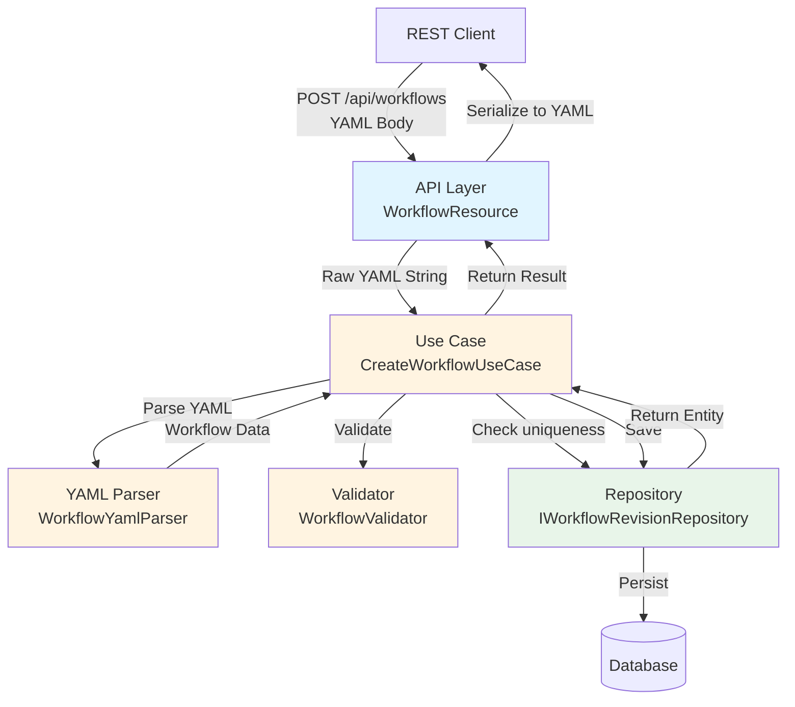

# Technical Specification: Workflow Creation (User Story 2.1)

## 1. Overview

### 1.1 Feature Summary
This technical specification details the implementation of **User Story 2.1: Workflow Creation** from the Workflow Management feature. It covers the creation of a new workflow with its first revision, including all necessary components across the model, core, and API layers.

### 1.2 Related Documents
- **Functional Specification**: [01-functional-spec.md](./01-functional-spec.md) - Section 2.1, REQ-WF-001 to REQ-WF-007
- **User Story**: 2.1 Workflow Creation
- **Acceptance Criteria**: Functional Spec Section 2.1

### 1.3 Scope
This specification covers:
- Model extensions to support workflow metadata (name, active state, timestamps)
- YAML parsing and validation for workflow definitions
- Core service layer for workflow creation business logic
- REST API endpoint for workflow creation
- Validation and error handling
- Database schema design

**Out of Scope** (covered in separate specs):
- Revision creation (User Story 2.2)
- Revision updates (User Story 2.3)
- Activation/deactivation (User Story 2.4)
- Deletion operations (User Stories 2.5 and 2.6)

## 2. Architecture

### 2.1 Component Overview



### 2.2 Layer Responsibilities

#### 2.2.1 Model Layer (`model` module)
- **WorkflowRevision**: Extended data class with new fields
- **Step Hierarchy**: Existing step definitions (unchanged)
- **Value Objects**: WorkflowRevisionID implementation

#### 2.2.2 Core Layer (`core` module)
- **CreateWorkflowUseCase**: Single-purpose use case for workflow creation business logic
- **WorkflowYamlParser**: YAML to domain model parsing (business logic concern)
- **WorkflowValidator**: Validation logic for workflow data
- **IWorkflowRevisionRepository**: Repository interface definition (port)
- **Domain Exceptions**: Business rule violations

#### 2.2.3 API Layer (`api` module)
- **WorkflowResource**: REST endpoint for workflow creation
- **Request/Response DTOs**: API contract models (for serialization only)
- **Exception Mappers**: HTTP error response mapping

## 3. Data Model

### 3.1 Model Layer Changes

#### 3.1.1 WorkflowRevision Extensions

**File**: `model/src/main/kotlin/io/maestro/model/WorkflowRevision.kt`

```kotlin
package io.maestro.model

import io.maestro.model.exception.InvalidWorkflowRevisionException
import io.maestro.model.steps.Step
import java.time.Instant

/**
 * Represents a specific version of a workflow definition without the YAML source.
 * This is the core domain model used for workflow execution and most operations.
 *
 * @property namespace Logical namespace for workflow isolation (e.g., "production", "development")
 * @property id Unique identifier for the workflow within its namespace
 * @property version Sequential version number (starts at 1)
 * @property name Human-readable name for the workflow
 * @property description Detailed description of what this workflow does
 * @property active Whether this revision is currently active and available for execution
 * @property rootStep Root step definition for the workflow (typically a Sequence or other orchestration step)
 * @property createdAt Timestamp when this revision was created (UTC, immutable)
 * @property updatedAt Timestamp when this revision was last modified (UTC)
 * @throws InvalidWorkflowRevisionException if validation fails
 */
data class WorkflowRevision(
    override val namespace: String,
    override val id: String,
    override val version: Long,
    val name: String,
    val description: String,
    val active: Boolean = false,
    val rootStep: Step,
    val createdAt: Instant,
    val updatedAt: Instant
) : IWorkflowRevisionID {

    init {
        val errors = mutableListOf<String>()

        if (namespace.isBlank()) errors.add("Namespace must not be blank")
        if (id.isBlank()) errors.add("ID must not be blank")
        if (version <= 0) errors.add("Version must be positive")
        if (name.isBlank()) errors.add("Name must not be blank")
        if (description.isBlank()) errors.add("Description must not be blank")

        if (errors.isNotEmpty()) {
            throw InvalidWorkflowRevisionException(
                message = "Invalid workflow revision: ${errors.joinToString(", ")}",
                field = when {
                    namespace.isBlank() -> "namespace"
                    id.isBlank() -> "id"
                    version <= 0 -> "version"
                    name.isBlank() -> "name"
                    else -> "description"
                },
                rejectedValue = when {
                    namespace.isBlank() -> namespace
                    id.isBlank() -> id
                    version <= 0 -> version
                    name.isBlank() -> name
                    else -> description
                }
            )
        }
    }

    /**
     * Creates a copy of this revision with updated timestamp
     */
    fun withUpdatedTimestamp(timestamp: Instant = Instant.now()): WorkflowRevision {
        return copy(updatedAt = timestamp)
    }

    /**
     * Creates a copy of this revision with active state changed
     */
    fun withActiveState(newActiveState: Boolean, timestamp: Instant = Instant.now()): WorkflowRevision {
        return copy(active = newActiveState, updatedAt = timestamp)
    }
}

/**
 * Represents a workflow revision WITH its original YAML source.
 * Use this class only when the YAML source is needed (e.g., for API responses, exports, auditing).
 * For execution and most operations, use WorkflowRevision instead.
 *
 * @property revision The core workflow revision data
 * @property yaml Original YAML definition (preserves formatting and comments)
 * @throws InvalidWorkflowRevisionException if validation fails
 */
data class WorkflowRevisionWithSource(
    val revision: WorkflowRevision,
    val yaml: String
) {
    init {
        if (yaml.isBlank()) {
            throw InvalidWorkflowRevisionException(
                message = "YAML definition must not be blank",
                field = "yaml",
                rejectedValue = yaml
            )
        }
    }

    // Delegate common properties for convenience
    val namespace: String get() = revision.namespace
    val id: String get() = revision.id
    val version: Long get() = revision.version
    val name: String get() = revision.name
    val description: String get() = revision.description
    val active: Boolean get() = revision.active
    val rootStep: Step get() = revision.rootStep
    val createdAt: Instant get() = revision.createdAt
    val updatedAt: Instant get() = revision.updatedAt
}
```

**Key Changes**:
- Added `name: String` field for human-readable workflow name
- **Renamed `steps` to `rootStep`** (clearer naming - it's the root of the step tree)
- Added `active: Boolean` (default `false`) for activation state
- **Removed `yaml` field from WorkflowRevision** - keeps the core model lightweight
- **Created `WorkflowRevisionWithSource`** - separate class for when YAML source is needed
- Added `createdAt: Instant` for creation timestamp (immutable)
- Added `updatedAt: Instant` for last modification timestamp
- **Replaced `require()` with business exceptions** - throws `InvalidWorkflowRevisionException` for validation errors
- **Model exceptions implement RFC 7807** - enables proper Problem Details for HTTP APIs
- Added helper methods for immutable updates
- WorkflowRevisionWithSource delegates common properties for convenience

#### 3.1.2 WorkflowRevisionID Value Object

**File**: `model/src/main/kotlin/io/maestro/model/IWorkflowRevisionID.kt`

```kotlin
package io.maestro.model

import io.maestro.model.exception.InvalidWorkflowRevisionException

/**
 * Composite identifier for a workflow revision.
 * The combination of namespace, id, and version uniquely identifies a revision.
 */
interface IWorkflowRevisionID {
    val namespace: String
    val id: String
    val version: Long
}

/**
 * Standalone implementation of workflow revision ID for queries
 * @throws InvalidWorkflowRevisionException if validation fails
 */
data class WorkflowRevisionID(
    override val namespace: String,
    override val id: String,
    override val version: Long
) : IWorkflowRevisionID {

    init {
        val errors = mutableListOf<String>()

        if (namespace.isBlank()) errors.add("Namespace must not be blank")
        if (id.isBlank()) errors.add("ID must not be blank")
        if (version <= 0) errors.add("Version must be positive")

        if (errors.isNotEmpty()) {
            throw InvalidWorkflowRevisionException(
                message = "Invalid workflow revision ID: ${errors.joinToString(", ")}",
                field = when {
                    namespace.isBlank() -> "namespace"
                    id.isBlank() -> "id"
                    else -> "version"
                },
                rejectedValue = when {
                    namespace.isBlank() -> namespace
                    id.isBlank() -> id
                    else -> version
                }
            )
        }
    }
}
```

#### 3.1.3 Model Layer Exceptions

**File**: `model/src/main/kotlin/io/maestro/model/exception/ModelExceptions.kt`

Model layer exceptions implement RFC 7807 (Problem Details for HTTP APIs) structure to enable
proper error reporting in API responses.

```kotlin
package io.maestro.model.exception

/**
 * Base exception for model validation errors.
 * Implements RFC 7807 Problem Details structure.
 *
 * @property message Human-readable error message
 * @property field The field that failed validation
 * @property rejectedValue The value that was rejected
 * @property type URI reference that identifies the problem type (RFC 7807)
 */
sealed class ModelValidationException(
    override val message: String,
    open val field: String,
    open val rejectedValue: Any?,
    open val type: String = "about:blank"
) : RuntimeException(message)

/**
 * Thrown when a WorkflowRevision or WorkflowRevisionID fails validation.
 * Maps to HTTP 400 Bad Request with RFC 7807 Problem Details.
 *
 * @property message Human-readable description of the validation failure
 * @property field The specific field that failed validation
 * @property rejectedValue The value that was rejected during validation
 */
class InvalidWorkflowRevisionException(
    override val message: String,
    override val field: String,
    override val rejectedValue: Any?,
    override val type: String = "/problems/invalid-workflow-revision"
) : ModelValidationException(message, field, rejectedValue, type)
```

### 3.2 Database Schema (PostgreSQL 18)

**Implementation Module**: `plugins/postgresql` (separate plugin module)

The PostgreSQL implementation will be provided in a separate plugin module that implements the `IWorkflowRevisionRepository` interface.

#### 3.2.1 Table Definition

**PostgreSQL Version**: 18+

This schema uses PostgreSQL 18's generated columns feature to extract workflow attributes from the JSONB document,
avoiding data duplication while maintaining query performance.

```sql
CREATE TABLE workflow_revisions (
    -- Composite Primary Key
    namespace VARCHAR(100) NOT NULL,
    id VARCHAR(100) NOT NULL,
    version BIGINT NOT NULL,

    -- Complete Workflow Revision (source of truth)
    -- Stores the entire WorkflowRevision as JSONB
    workflow_data JSONB NOT NULL,

    -- Original YAML Source (for API responses and auditing)
    yaml TEXT NOT NULL,

    -- Generated Columns (PostgreSQL 18+)
    -- These are computed from workflow_data JSONB for efficient querying
    -- STORED means they are physically stored and indexed
    name VARCHAR(255) GENERATED ALWAYS AS (workflow_data->>'name') STORED,
    description VARCHAR(1000) GENERATED ALWAYS AS (workflow_data->>'description') STORED,
    active BOOLEAN GENERATED ALWAYS AS ((workflow_data->>'active')::boolean) STORED,
    created_at TIMESTAMP WITH TIME ZONE GENERATED ALWAYS AS (
        to_timestamp((workflow_data->>'createdAt')::text, 'YYYY-MM-DD"T"HH24:MI:SS.MS"Z"')
    ) STORED,
    updated_at TIMESTAMP WITH TIME ZONE GENERATED ALWAYS AS (
        to_timestamp((workflow_data->>'updatedAt')::text, 'YYYY-MM-DD"T"HH24:MI:SS.MS"Z"')
    ) STORED,

    -- Primary Key Constraint
    PRIMARY KEY (namespace, id, version),

    -- Check Constraints
    CONSTRAINT chk_version_positive CHECK (version > 0),
    CONSTRAINT chk_namespace_not_blank CHECK (LENGTH(TRIM(namespace)) > 0),
    CONSTRAINT chk_id_not_blank CHECK (LENGTH(TRIM(id)) > 0),
    CONSTRAINT chk_namespace_format CHECK (namespace ~ '^[a-zA-Z0-9_-]+$'),
    CONSTRAINT chk_id_format CHECK (id ~ '^[a-zA-Z0-9_-]+$'),

    -- JSONB validation constraints
    CONSTRAINT chk_workflow_data_has_namespace CHECK (workflow_data->>'namespace' = namespace),
    CONSTRAINT chk_workflow_data_has_id CHECK (workflow_data->>'id' = id),
    CONSTRAINT chk_workflow_data_has_version CHECK ((workflow_data->>'version')::bigint = version),
    CONSTRAINT chk_workflow_data_has_name CHECK (workflow_data ? 'name'),
    CONSTRAINT chk_workflow_data_has_description CHECK (workflow_data ? 'description'),
    CONSTRAINT chk_workflow_data_has_rootStep CHECK (workflow_data ? 'rootStep')
);

-- Index for uniqueness check on first revision
CREATE UNIQUE INDEX idx_workflow_first_revision
ON workflow_revisions (namespace, id)
WHERE version = 1;

-- Index for querying active revisions (uses generated column)
CREATE INDEX idx_workflow_active
ON workflow_revisions (namespace, id, active)
WHERE active = TRUE;

-- Index for querying all revisions of a workflow
CREATE INDEX idx_workflow_revisions
ON workflow_revisions (namespace, id, version DESC);

-- Index for timestamp-based queries (uses generated column)
CREATE INDEX idx_workflow_updated
ON workflow_revisions (updated_at DESC);

-- GIN index for JSONB workflow_data to support complex queries on rootStep
CREATE INDEX idx_workflow_data_gin
ON workflow_revisions USING GIN (workflow_data jsonb_path_ops);

-- Add comments for documentation
COMMENT ON TABLE workflow_revisions IS
'Stores all versions of workflow definitions. PostgreSQL 18+ implementation using JSONB with generated columns.';

COMMENT ON COLUMN workflow_revisions.workflow_data IS
'Complete WorkflowRevision stored as JSONB. This is the single source of truth for all workflow data.
Structure: {namespace, id, version, name, description, active, rootStep, createdAt, updatedAt}';

COMMENT ON COLUMN workflow_revisions.yaml IS
'Original YAML source preserving formatting and comments. Used for API responses, exports, and auditing.';

COMMENT ON COLUMN workflow_revisions.name IS
'Generated column extracted from workflow_data->>"name". Stored for efficient querying and indexing.';

COMMENT ON COLUMN workflow_revisions.description IS
'Generated column extracted from workflow_data->>"description". Stored for efficient querying.';

COMMENT ON COLUMN workflow_revisions.active IS
'Generated column extracted from workflow_data->>"active". Stored for efficient querying and indexing.';

COMMENT ON COLUMN workflow_revisions.created_at IS
'Generated column extracted from workflow_data->>"createdAt". Stored for efficient timestamp queries.';

COMMENT ON COLUMN workflow_revisions.updated_at IS
'Generated column extracted from workflow_data->>"updatedAt". Stored for efficient timestamp queries and indexing.';
```

#### 3.2.2 Example JSONB Structure

The `workflow_data` column stores the complete `WorkflowRevision` as JSONB:

```json
{
  "namespace": "production",
  "id": "payment-processing",
  "version": 1,
  "name": "Payment Processing Workflow",
  "description": "Handles payment processing with validation",
  "active": false,
  "rootStep": {
    "type": "Sequence",
    "steps": [
      {
        "type": "LogTask",
        "message": "Starting payment processing"
      },
      {
        "type": "Task",
        "name": "validate-payment"
      }
    ]
  },
  "createdAt": "2025-11-20T10:30:00.000Z",
  "updatedAt": "2025-11-20T10:30:00.000Z"
}
```

**Design Rationale**:
- **Single Source of Truth**: `workflow_data` JSONB column contains the complete WorkflowRevision
- **No Data Duplication**: Workflow attributes are generated from the JSONB, not stored separately
- **Generated Columns (PostgreSQL 18)**: Automatically computed and physically stored for performance
- **Query Performance**: Generated columns can be indexed just like regular columns
- **Schema Evolution**: Easy to add new attributes - just add a new generated column
- **JSONB Validation**: Check constraints ensure JSONB structure matches primary key
- **GIN Index**: Enables efficient queries on the rootStep structure
- **Composite Primary Key**: (namespace, id, version) ensures uniqueness
- **TEXT for yaml**: Preserves original formatting and comments
- **Unique Index on First Revision**: Enforces uniqueness constraint per REQ-WF-004
- **Partial Index on Active**: Optimizes queries for active revisions using generated column
- **Regex Check Constraints**: Enforces naming conventions per REQ-WF-047, REQ-WF-048

**Benefits of this Approach**:
1. **Flexibility**: Entire domain object stored as JSONB, easy to evolve
2. **Performance**: Generated columns provide same query performance as regular columns
3. **Consistency**: Single source of truth prevents data inconsistency
4. **PostgreSQL 18 Features**: Leverages latest database capabilities
5. **Clean Architecture**: Database schema closely mirrors domain model

## 4. Core Layer Implementation

### 4.1 Repository Interface Extensions

**File**: `core/src/main/kotlin/io/maestro/core/repository/IWorkflowRevisionRepository.kt`

```kotlin
package io.maestro.core.repository

import io.maestro.model.IWorkflowRevisionID
import io.maestro.model.WorkflowRevision
import io.maestro.model.WorkflowRevisionWithSource

/**
 * Repository interface for workflow revision persistence operations.
 */
interface IWorkflowRevisionRepository {

    /**
     * Finds a workflow revision by its composite ID (without YAML source).
     * Use this for execution and operations that don't need the YAML source.
     *
     * @param id Composite identifier (namespace, id, version)
     * @return The workflow revision if found, null otherwise
     */
    fun findById(id: IWorkflowRevisionID): WorkflowRevision?

    /**
     * Finds a workflow revision WITH its YAML source by its composite ID.
     * Use this for API responses, exports, or auditing when the YAML source is needed.
     *
     * @param id Composite identifier (namespace, id, version)
     * @return The workflow revision with source if found, null otherwise
     */
    fun findByIdWithSource(id: IWorkflowRevisionID): WorkflowRevisionWithSource?

    /**
     * Checks if a workflow with the given namespace and id already exists.
     * This is specifically for checking version 1 existence during creation.
     *
     * @param namespace Workflow namespace
     * @param id Workflow ID
     * @return true if any version exists for this workflow
     */
    fun existsByWorkflowId(namespace: String, id: String): Boolean

    /**
     * Saves a workflow revision WITH its YAML source (create or update).
     *
     * @param workflowRevision The revision to save
     * @param yaml The original YAML source
     * @return The saved revision (without source - use findByIdWithSource if needed)
     * @throws DataIntegrityViolationException if uniqueness constraints are violated
     */
    fun save(workflowRevision: WorkflowRevision, yaml: String): WorkflowRevision

    /**
     * Finds all workflow revisions (without YAML source, primarily for testing/admin purposes).
     *
     * @return List of all revisions
     */
    fun findAll(): List<WorkflowRevision>

    /**
     * Deletes a workflow revision by its composite ID.
     *
     * @param id Composite identifier (namespace, id, version)
     */
    fun deleteById(id: IWorkflowRevisionID)
}
```

### 4.2 Workflow Creation Use Case

**File**: `core/src/main/kotlin/io/maestro/core/usecase/CreateWorkflowUseCase.kt`

```kotlin
package io.maestro.core.usecase

import io.maestro.core.exception.WorkflowAlreadyExistsException
import io.maestro.core.repository.IWorkflowRevisionRepository
import io.maestro.core.validation.WorkflowValidator
import io.maestro.model.WorkflowRevision
import io.maestro.model.steps.Step
import java.time.Instant

/**
 * Use case for creating a new workflow with its first revision.
 * Implements REQ-WF-001 through REQ-WF-007.
 *
 * This use case encapsulates the business logic for workflow creation following
 * Clean Architecture principles - single responsibility, framework-agnostic.
 */
class CreateWorkflowUseCase(
    private val repository: IWorkflowRevisionRepository,
    private val validator: WorkflowValidator,
    private val yamlParser: WorkflowYamlParser
) {

    /**
     * Executes the workflow creation use case.
     *
     * Implements:
     * - REQ-WF-001: Create workflow with namespace, id, description, rootStep
     * - REQ-WF-002: Assign version 1 to first revision
     * - REQ-WF-003: Set active=false by default
     * - REQ-WF-004: Validate uniqueness of namespace+id
     * - REQ-WF-005: Set createdAt and updatedAt timestamps
     * - REQ-WF-006: Validate step definition
     * - REQ-WF-007: Persist and return created entity
     *
     * @param yaml Raw YAML string containing workflow definition
     * @return The created workflow revision (without YAML source)
     * @throws WorkflowAlreadyExistsException if workflow already exists (REQ-WF-004)
     * @throws WorkflowValidationException if validation or parsing fails (REQ-WF-006)
     */
    fun execute(yaml: String): WorkflowRevision {
        // Parse YAML to extract workflow data
        val parsedData = yamlParser.parseWorkflowDefinition(yaml)

        // REQ-WF-004: Validate uniqueness
        if (repository.existsByWorkflowId(parsedData.namespace, parsedData.id)) {
            throw WorkflowAlreadyExistsException(
                "Workflow with namespace '${parsedData.namespace}' and id '${parsedData.id}' already exists"
            )
        }

        // REQ-WF-006: Validate workflow data
        validator.validateWorkflowCreation(
            namespace = parsedData.namespace,
            id = parsedData.id,
            name = parsedData.name,
            description = parsedData.description,
            rootStep = parsedData.rootStep,
            yaml = yaml
        )

        // REQ-WF-002, REQ-WF-003, REQ-WF-005: Create revision with defaults
        val now = Instant.now()
        val revision = WorkflowRevision(
            namespace = parsedData.namespace,
            id = parsedData.id,
            version = 1L, // REQ-WF-002: First revision is version 1
            name = parsedData.name,
            description = parsedData.description,
            active = parsedData.active, // REQ-WF-003: Default false
            rootStep = parsedData.rootStep,
            createdAt = now, // REQ-WF-005: Set creation timestamp
            updatedAt = now  // REQ-WF-005: Set update timestamp
        )

        // REQ-WF-007: Persist with YAML source and return (repository stores YAML separately)
        return repository.save(revision, yaml)
    }
}
```

### 4.3 Validation Service

**File**: `core/src/main/kotlin/io/maestro/core/validation/WorkflowValidator.kt`

```kotlin
package io.maestro.core.validation

import io.maestro.core.exception.WorkflowValidationException
import io.maestro.model.steps.Step
import jakarta.enterprise.context.ApplicationScoped

/**
 * Validator for workflow data.
 * Implements validation requirements REQ-WF-047 through REQ-WF-058.
 */
@ApplicationScoped
class WorkflowValidator {

    companion object {
        private const val MAX_NAMESPACE_LENGTH = 100
        private const val MAX_ID_LENGTH = 100
        private const val MAX_NAME_LENGTH = 255
        private const val MAX_DESCRIPTION_LENGTH = 1000
        private val NAMING_PATTERN = Regex("^[a-zA-Z0-9_-]+$")
    }

    /**
     * Validates workflow creation request.
     *
     * @throws WorkflowValidationException if any validation fails
     */
    fun validateWorkflowCreation(
        namespace: String,
        id: String,
        name: String,
        description: String,
        rootStep: Step,
        yaml: String
    ) {
        val errors = mutableListOf<String>()

        // REQ-WF-047: Validate namespace
        validateNamespace(namespace, errors)

        // REQ-WF-048: Validate id
        validateId(id, errors)

        // Validate name
        validateName(name, errors)

        // REQ-WF-050: Validate description
        validateDescription(description, errors)

        // REQ-WF-051, REQ-WF-054, REQ-WF-055: Validate root step
        validateRootStep(rootStep, errors)

        // Validate YAML
        validateYaml(yaml, errors)

        if (errors.isNotEmpty()) {
            throw WorkflowValidationException(
                "Workflow validation failed: ${errors.joinToString("; ")}"
            )
        }
    }

    /**
     * REQ-WF-047: Validate namespace format and constraints
     */
    private fun validateNamespace(namespace: String, errors: MutableList<String>) {
        when {
            namespace.isBlank() ->
                errors.add("Namespace must not be blank")
            namespace.length > MAX_NAMESPACE_LENGTH ->
                errors.add("Namespace must not exceed $MAX_NAMESPACE_LENGTH characters")
            !namespace.matches(NAMING_PATTERN) ->
                errors.add("Namespace must contain only alphanumeric characters, hyphens, and underscores")
        }
    }

    /**
     * REQ-WF-048: Validate id format and constraints
     */
    private fun validateId(id: String, errors: MutableList<String>) {
        when {
            id.isBlank() ->
                errors.add("ID must not be blank")
            id.length > MAX_ID_LENGTH ->
                errors.add("ID must not exceed $MAX_ID_LENGTH characters")
            !id.matches(NAMING_PATTERN) ->
                errors.add("ID must contain only alphanumeric characters, hyphens, and underscores")
        }
    }

    /**
     * Validate name constraints
     */
    private fun validateName(name: String, errors: MutableList<String>) {
        when {
            name.isBlank() ->
                errors.add("Name must not be blank")
            name.length > MAX_NAME_LENGTH ->
                errors.add("Name must not exceed $MAX_NAME_LENGTH characters")
        }
    }

    /**
     * REQ-WF-050: Validate description constraints
     */
    private fun validateDescription(description: String, errors: MutableList<String>) {
        when {
            description.isBlank() ->
                errors.add("Description must not be blank")
            description.length > MAX_DESCRIPTION_LENGTH ->
                errors.add("Description must not exceed $MAX_DESCRIPTION_LENGTH characters")
        }
    }

    /**
     * REQ-WF-051, REQ-WF-054, REQ-WF-055: Validate root step definition
     */
    private fun validateRootStep(rootStep: Step, errors: MutableList<String>) {
        try {
            // Validate step tree structure starting from root
            validateStepTree(rootStep, 0)
        } catch (e: Exception) {
            errors.add("Invalid root step definition: ${e.message}")
        }
    }

    /**
     * Recursively validates step tree with depth checking
     */
    private fun validateStepTree(step: Step, depth: Int) {
        // Prevent excessive nesting (max 10 levels)
        if (depth > 10) {
            throw IllegalStateException("Step nesting depth exceeds maximum of 10 levels")
        }

        // Step-specific validation would go here
        // For now, rely on model validation
    }

    /**
     * Validate YAML is not empty
     */
    private fun validateYaml(yaml: String, errors: MutableList<String>) {
        if (yaml.isBlank()) {
            errors.add("YAML definition must not be blank")
        }
    }
}
```

### 4.4 Domain Exceptions

**File**: `core/src/main/kotlin/io/maestro/core/exception/WorkflowExceptions.kt`

```kotlin
package io.maestro.core.exception

/**
 * Base exception for workflow-related errors
 */
sealed class WorkflowException(message: String, cause: Throwable? = null) :
    RuntimeException(message, cause)

/**
 * Thrown when attempting to create a workflow that already exists (REQ-WF-004)
 */
class WorkflowAlreadyExistsException(message: String) : WorkflowException(message)

/**
 * Thrown when workflow validation fails (REQ-WF-047 through REQ-WF-058)
 */
class WorkflowValidationException(message: String, cause: Throwable? = null) :
    WorkflowException(message, cause)

/**
 * Thrown when a requested workflow is not found
 */
class WorkflowNotFoundException(message: String) : WorkflowException(message)

/**
 * Thrown when attempting an invalid operation on a workflow
 */
class InvalidWorkflowOperationException(message: String) : WorkflowException(message)
```

### 4.5 YAML Parser (Core Layer)

**File**: `core/src/main/kotlin/io/maestro/core/parser/WorkflowYamlParser.kt`

**Rationale**: The YAML parser belongs in the Core layer because:
- YAML parsing is part of the workflow creation business logic, not just an infrastructure concern
- The Use Case needs to parse YAML to extract workflow data for validation
- Placing it in Core keeps the business logic framework-agnostic (only depends on Jackson, not Quarkus/JAX-RS)
- The API layer only handles HTTP serialization/deserialization for responses

```kotlin
package io.maestro.core.parser

import com.fasterxml.jackson.databind.ObjectMapper
import com.fasterxml.jackson.dataformat.yaml.YAMLFactory
import com.fasterxml.jackson.module.kotlin.KotlinModule
import com.fasterxml.jackson.module.kotlin.readValue
import io.maestro.core.exception.WorkflowValidationException
import io.maestro.model.steps.Step

/**
 * Parser for YAML workflow definitions.
 * Implements REQ-WF-056, REQ-WF-057, REQ-WF-058.
 *
 * This is part of the Core layer because YAML parsing is business logic required
 * by the workflow creation use case, not just an API infrastructure concern.
 */
class WorkflowYamlParser {

    private val yamlMapper = ObjectMapper(YAMLFactory()).apply {
        registerModule(KotlinModule.Builder().build())
    }

    /**
     * Parses YAML workflow definition into a parsed workflow data object.
     *
     * @param yaml YAML string to parse
     * @return Parsed workflow data
     * @throws WorkflowValidationException if YAML is malformed or invalid
     */
    fun parseWorkflowDefinition(yaml: String): ParsedWorkflowData {
        try {
            // REQ-WF-056: Parse YAML into domain model
            return yamlMapper.readValue<ParsedWorkflowData>(yaml)
        } catch (e: Exception) {
            // REQ-WF-057: Reject malformed YAML with clear error
            throw WorkflowValidationException(
                "Invalid YAML syntax: ${e.message}",
                e
            )
        }
    }

    /**
     * Serializes workflow data back to YAML.
     *
     * @param obj Object to serialize
     * @return YAML string representation
     */
    fun toYaml(obj: Any): String {
        return yamlMapper.writeValueAsString(obj)
    }
}

/**
 * Parsed workflow data from YAML.
 * This is a Core layer model, not tied to any API framework.
 */
data class ParsedWorkflowData(
    val namespace: String,
    val id: String,
    val name: String,
    val description: String,
    val active: Boolean = false,
    val rootStep: Step
)
```

## 5. PostgreSQL Plugin Module Implementation

### 5.1 Module Structure

**Module**: `plugins/postgresql`

This module provides the PostgreSQL 18 implementation of the `IWorkflowRevisionRepository` interface.
It is a separate plugin module to keep database-specific code isolated from the core business logic.

**Dependencies**:
- `core` module (for `IWorkflowRevisionRepository` interface)
- `model` module (for domain entities)
- JDBI 3.x (for database access)
- PostgreSQL JDBC Driver
- Jackson (for JSONB serialization/deserialization)

### 5.2 Repository Implementation

**File**: `plugins/postgresql/src/main/kotlin/io/maestro/plugin/postgresql/PostgresWorkflowRevisionRepository.kt`

```kotlin
package io.maestro.plugin.postgresql

import com.fasterxml.jackson.databind.ObjectMapper
import com.fasterxml.jackson.module.kotlin.readValue
import io.maestro.core.repository.IWorkflowRevisionRepository
import io.maestro.model.IWorkflowRevisionID
import io.maestro.model.WorkflowRevision
import io.maestro.model.WorkflowRevisionWithSource
import jakarta.enterprise.context.ApplicationScoped
import jakarta.inject.Inject
import org.jdbi.v3.core.Jdbi

/**
 * PostgreSQL 18 implementation of IWorkflowRevisionRepository.
 * Uses JSONB storage with generated columns for efficient querying.
 */
@ApplicationScoped
class PostgresWorkflowRevisionRepository @Inject constructor(
    private val jdbi: Jdbi,
    private val objectMapper: ObjectMapper
) : IWorkflowRevisionRepository {

    override fun findById(id: IWorkflowRevisionID): WorkflowRevision? {
        return jdbi.withHandle<WorkflowRevision?, Exception> { handle ->
            handle.createQuery(
                """
                SELECT workflow_data
                FROM workflow_revisions
                WHERE namespace = :namespace
                  AND id = :id
                  AND version = :version
                """
            )
                .bind("namespace", id.namespace)
                .bind("id", id.id)
                .bind("version", id.version)
                .mapTo(String::class.java)
                .findOne()
                .map { jsonString -> objectMapper.readValue<WorkflowRevision>(jsonString) }
                .orElse(null)
        }
    }

    override fun findByIdWithSource(id: IWorkflowRevisionID): WorkflowRevisionWithSource? {
        return jdbi.withHandle<WorkflowRevisionWithSource?, Exception> { handle ->
            handle.createQuery(
                """
                SELECT workflow_data, yaml
                FROM workflow_revisions
                WHERE namespace = :namespace
                  AND id = :id
                  AND version = :version
                """
            )
                .bind("namespace", id.namespace)
                .bind("id", id.id)
                .bind("version", id.version)
                .map { rs, _ ->
                    val workflowJson = rs.getString("workflow_data")
                    val yaml = rs.getString("yaml")
                    val revision = objectMapper.readValue<WorkflowRevision>(workflowJson)
                    WorkflowRevisionWithSource(revision, yaml)
                }
                .findOne()
                .orElse(null)
        }
    }

    override fun existsByWorkflowId(namespace: String, id: String): Boolean {
        return jdbi.withHandle<Boolean, Exception> { handle ->
            handle.createQuery(
                """
                SELECT EXISTS(
                    SELECT 1
                    FROM workflow_revisions
                    WHERE namespace = :namespace
                      AND id = :id
                      AND version = 1
                )
                """
            )
                .bind("namespace", namespace)
                .bind("id", id)
                .mapTo(Boolean::class.java)
                .one()
        }
    }

    override fun save(workflowRevision: WorkflowRevision, yaml: String): WorkflowRevision {
        jdbi.useHandle<Exception> { handle ->
            // Serialize WorkflowRevision to JSONB
            val workflowJson = objectMapper.writeValueAsString(workflowRevision)

            handle.createUpdate(
                """
                INSERT INTO workflow_revisions (namespace, id, version, workflow_data, yaml)
                VALUES (:namespace, :id, :version, :workflowData::jsonb, :yaml)
                ON CONFLICT (namespace, id, version)
                DO UPDATE SET
                    workflow_data = EXCLUDED.workflow_data,
                    yaml = EXCLUDED.yaml
                """
            )
                .bind("namespace", workflowRevision.namespace)
                .bind("id", workflowRevision.id)
                .bind("version", workflowRevision.version)
                .bind("workflowData", workflowJson)
                .bind("yaml", yaml)
                .execute()
        }

        return workflowRevision
    }

    override fun findAll(): List<WorkflowRevision> {
        return jdbi.withHandle<List<WorkflowRevision>, Exception> { handle ->
            handle.createQuery("SELECT workflow_data FROM workflow_revisions")
                .mapTo(String::class.java)
                .map { jsonString -> objectMapper.readValue<WorkflowRevision>(jsonString) }
                .list()
        }
    }

    override fun deleteById(id: IWorkflowRevisionID) {
        jdbi.useHandle<Exception> { handle ->
            handle.createUpdate(
                """
                DELETE FROM workflow_revisions
                WHERE namespace = :namespace
                  AND id = :id
                  AND version = :version
                """
            )
                .bind("namespace", id.namespace)
                .bind("id", id.id)
                .bind("version", id.version)
                .execute()
        }
    }
}
```

### 5.3 Jackson Configuration

**File**: `plugins/postgresql/src/main/kotlin/io/maestro/plugin/postgresql/JacksonConfig.kt`

```kotlin
package io.maestro.plugin.postgresql

import com.fasterxml.jackson.databind.ObjectMapper
import com.fasterxml.jackson.databind.SerializationFeature
import com.fasterxml.jackson.datatype.jsr310.JavaTimeModule
import com.fasterxml.jackson.module.kotlin.KotlinModule
import jakarta.enterprise.context.ApplicationScoped
import jakarta.enterprise.inject.Produces
import jakarta.inject.Singleton

/**
 * Jackson ObjectMapper configuration for JSONB serialization/deserialization.
 */
@ApplicationScoped
class JacksonConfig {

    @Produces
    @Singleton
    fun objectMapper(): ObjectMapper {
        return ObjectMapper().apply {
            registerModule(KotlinModule.Builder().build())
            registerModule(JavaTimeModule())
            disable(SerializationFeature.WRITE_DATES_AS_TIMESTAMPS)
            // Configure for ISO-8601 date format
            configure(SerializationFeature.WRITE_DATE_TIMESTAMPS_AS_NANOSECONDS, false)
        }
    }
}
```

### 5.4 Module Architecture Benefits

**Separation of Concerns**:
- Core module defines the interface (port)
- PostgreSQL plugin provides the implementation (adapter)
- Easy to swap database implementations (e.g., MongoDB plugin, in-memory plugin)

**Technology Isolation**:
- JDBI and PostgreSQL-specific code isolated in plugin module
- Core business logic remains database-agnostic
- Clean Architecture dependency rule maintained

**PostgreSQL 18 Features**:
- Generated columns for query performance
- JSONB with GIN indexing for complex queries
- Single source of truth (workflow_data column)
- Type-safe JSONB operations

## 6. API Layer Implementation

### 6.1 DTOs (Data Transfer Objects)

**File**: `api/src/main/kotlin/io/maestro/api/dto/WorkflowDtos.kt`

```kotlin
package io.maestro.api.dto

import io.maestro.model.steps.Step
import java.time.Instant

/**
 * Response DTO for workflow revision (used for API responses with YAML source).
 * Maps to YAML output structure per API Contract.
 */
data class WorkflowRevisionResponse(
    val namespace: String,
    val id: String,
    val version: Long,
    val name: String,
    val description: String,
    val active: Boolean,
    val rootStep: Step,
    val createdAt: Instant,
    val updatedAt: Instant
)
```

**Note**: No request DTO is needed since the API accepts raw YAML strings.

### 6.2 REST Resource

**File**: `api/src/main/kotlin/io/maestro/api/resource/WorkflowResource.kt`

```kotlin
package io.maestro.api.resource

import io.maestro.api.dto.WorkflowRevisionResponse
import io.maestro.core.parser.WorkflowYamlParser
import io.maestro.core.repository.IWorkflowRevisionRepository
import io.maestro.core.usecase.CreateWorkflowUseCase
import io.maestro.model.WorkflowRevision
import io.maestro.model.WorkflowRevisionWithSource
import jakarta.inject.Inject
import jakarta.ws.rs.*
import jakarta.ws.rs.core.Response
import org.jboss.logging.Logger

/**
 * REST resource for workflow management operations.
 * Implements API Contract 4.1.1 for workflow creation.
 *
 * This resource acts as the adapter layer, translating HTTP requests
 * to use case executions following Clean Architecture principles.
 */
@Path("/api/workflows")
@Produces("application/x-yaml")
@Consumes("application/x-yaml")
class WorkflowResource @Inject constructor(
    private val createWorkflowUseCase: CreateWorkflowUseCase,
    private val repository: IWorkflowRevisionRepository,
    private val yamlParser: WorkflowYamlParser  // For serializing responses only
) {

    private val log = Logger.getLogger(WorkflowResource::class.java)

    /**
     * Creates a new workflow with its first revision.
     *
     * Endpoint: POST /api/workflows
     * Content-Type: application/x-yaml
     *
     * Implements API Contract 4.1.1 and requirements REQ-WF-001 through REQ-WF-007.
     *
     * @param yaml YAML workflow definition
     * @return 201 Created with workflow revision, or error response
     */
    @POST
    fun createWorkflow(yaml: String): Response {
        log.info("Received workflow creation request")

        try {
            // Execute use case with raw YAML
            // The use case handles parsing, validation, and persistence
            val created = createWorkflowUseCase.execute(yaml)

            log.info("Successfully created workflow: ${created.namespace}/${created.id} v${created.version}")

            // Fetch the workflow WITH its YAML source for the response
            val withSource = repository.findByIdWithSource(created)
                ?: throw IllegalStateException("Failed to retrieve created workflow")

            // Convert to response DTO
            val response = withSource.toResponse()

            // Serialize to YAML and return 201 Created
            val responseYaml = yamlParser.toYaml(response)

            return Response.status(Response.Status.CREATED)
                .entity(responseYaml)
                .build()

        } catch (e: Exception) {
            log.error("Failed to create workflow", e)
            throw e // Let exception mapper handle it
        }
    }

    /**
     * Extension function to convert WorkflowRevisionWithSource to response DTO
     */
    private fun WorkflowRevisionWithSource.toResponse() = WorkflowRevisionResponse(
        namespace = namespace,
        id = id,
        version = version,
        name = name,
        description = description,
        active = active,
        rootStep = rootStep,
        createdAt = createdAt,
        updatedAt = updatedAt
    )
}
```

### 6.3 Exception Mappers (RFC 7807 Problem Details)

**File**: `api/src/main/kotlin/io/maestro/api/exception/ExceptionMappers.kt`

Exception mappers implement RFC 7807 (Problem Details for HTTP APIs) for standardized error responses.

```kotlin
package io.maestro.api.exception

import io.maestro.core.exception.WorkflowAlreadyExistsException
import io.maestro.core.exception.WorkflowNotFoundException
import io.maestro.core.exception.WorkflowValidationException
import io.maestro.model.exception.InvalidWorkflowRevisionException
import io.maestro.model.exception.ModelValidationException
import jakarta.ws.rs.core.Response
import jakarta.ws.rs.ext.ExceptionMapper
import jakarta.ws.rs.ext.Provider
import java.net.URI
import java.time.Instant

/**
 * RFC 7807 Problem Details response structure.
 * See: https://datatracker.ietf.org/doc/html/rfc7807
 *
 * @property type A URI reference that identifies the problem type
 * @property title A short, human-readable summary of the problem type
 * @property status The HTTP status code
 * @property detail A human-readable explanation specific to this occurrence
 * @property instance A URI reference that identifies the specific occurrence
 * @property timestamp When the problem occurred (extension)
 * @property field The field that caused the problem (extension for validation errors)
 * @property rejectedValue The value that was rejected (extension for validation errors)
 */
data class ProblemDetail(
    val type: URI,
    val title: String,
    val status: Int,
    val detail: String,
    val instance: URI? = null,
    val timestamp: Instant = Instant.now(),
    val field: String? = null,
    val rejectedValue: Any? = null
)

/**
 * Maps ModelValidationException to 400 Bad Request with RFC 7807 Problem Details
 */
@Provider
class ModelValidationExceptionMapper : ExceptionMapper<ModelValidationException> {
    override fun toResponse(exception: ModelValidationException): Response {
        val problemDetail = ProblemDetail(
            type = URI.create(exception.type),
            title = "Validation Failed",
            status = 400,
            detail = exception.message,
            field = exception.field,
            rejectedValue = exception.rejectedValue
        )

        return Response.status(Response.Status.BAD_REQUEST)
            .entity(problemDetail)
            .type("application/problem+json")
            .build()
    }
}

/**
 * Maps InvalidWorkflowRevisionException (from model layer) to 400 Bad Request
 */
@Provider
class InvalidWorkflowRevisionExceptionMapper : ExceptionMapper<InvalidWorkflowRevisionException> {
    override fun toResponse(exception: InvalidWorkflowRevisionException): Response {
        val problemDetail = ProblemDetail(
            type = URI.create(exception.type),
            title = "Invalid Workflow Revision",
            status = 400,
            detail = exception.message,
            field = exception.field,
            rejectedValue = exception.rejectedValue
        )

        return Response.status(Response.Status.BAD_REQUEST)
            .entity(problemDetail)
            .type("application/problem+json")
            .build()
    }
}

/**
 * Maps WorkflowValidationException (from core layer) to 400 Bad Request
 */
@Provider
class WorkflowValidationExceptionMapper : ExceptionMapper<WorkflowValidationException> {
    override fun toResponse(exception: WorkflowValidationException): Response {
        val problemDetail = ProblemDetail(
            type = URI.create("/problems/workflow-validation-failed"),
            title = "Workflow Validation Failed",
            status = 400,
            detail = exception.message ?: "Validation failed"
        )

        return Response.status(Response.Status.BAD_REQUEST)
            .entity(problemDetail)
            .type("application/problem+json")
            .build()
    }
}

/**
 * Maps WorkflowAlreadyExistsException to 409 Conflict
 */
@Provider
class WorkflowAlreadyExistsExceptionMapper : ExceptionMapper<WorkflowAlreadyExistsException> {
    override fun toResponse(exception: WorkflowAlreadyExistsException): Response {
        val problemDetail = ProblemDetail(
            type = URI.create("/problems/workflow-already-exists"),
            title = "Workflow Already Exists",
            status = 409,
            detail = exception.message ?: "Workflow already exists"
        )

        return Response.status(Response.Status.CONFLICT)
            .entity(problemDetail)
            .type("application/problem+json")
            .build()
    }
}

/**
 * Maps WorkflowNotFoundException to 404 Not Found
 */
@Provider
class WorkflowNotFoundExceptionMapper : ExceptionMapper<WorkflowNotFoundException> {
    override fun toResponse(exception: WorkflowNotFoundException): Response {
        val problemDetail = ProblemDetail(
            type = URI.create("/problems/workflow-not-found"),
            title = "Workflow Not Found",
            status = 404,
            detail = exception.message ?: "Workflow not found"
        )

        return Response.status(Response.Status.NOT_FOUND)
            .entity(problemDetail)
            .type("application/problem+json")
            .build()
    }
}

/**
 * Generic exception mapper for unhandled exceptions
 */
@Provider
class GenericExceptionMapper : ExceptionMapper<Exception> {
    override fun toResponse(exception: Exception): Response {
        val problemDetail = ProblemDetail(
            type = URI.create("about:blank"),
            title = "Internal Server Error",
            status = 500,
            detail = "An unexpected error occurred"
        )

        return Response.status(Response.Status.INTERNAL_SERVER_ERROR)
            .entity(problemDetail)
            .type("application/problem+json")
            .build()
    }
}
```

## 7. Implementation Checklist

### 7.1 Model Layer
- [ ] Extend `WorkflowRevision` with new fields (name, active, rootStep, timestamps)
- [ ] Remove yaml field from `WorkflowRevision` - keep model lightweight
- [ ] Create `WorkflowRevisionWithSource` class for cases when YAML source is needed
- [ ] **Create model exception hierarchy implementing RFC 7807**:
  - [ ] `ModelValidationException` base class with `type`, `field`, `rejectedValue` properties
  - [ ] `InvalidWorkflowRevisionException` for data class validation failures
- [ ] **Replace `require()` with business exceptions in `init` blocks**
- [ ] Add helper methods (`withUpdatedTimestamp`, `withActiveState`)
- [ ] Create `WorkflowRevisionID` value object with business exception validation
- [ ] Write unit tests for model validation and exception handling

### 7.2 Core Layer
- [ ] Extend `IWorkflowRevisionRepository` with:
  - [ ] `existsByWorkflowId` method
  - [ ] `findByIdWithSource` method (returns WorkflowRevisionWithSource)
  - [ ] Update `save` method signature to accept YAML separately
- [ ] Create `WorkflowYamlParser` in core layer for YAML parsing
- [ ] Create `ParsedWorkflowData` data class with `rootStep` field
- [ ] Create `CreateWorkflowUseCase` with `execute(yaml: String)` method
- [ ] Create `WorkflowValidator` with validation methods (using `rootStep` parameter)
- [ ] Create exception classes (`WorkflowAlreadyExistsException`, etc.)
- [ ] Write unit tests for YAML parser
- [ ] Write unit tests for use case logic
- [ ] Write unit tests for validation logic

### 7.3 PostgreSQL Plugin Module (`plugins/postgresql`)
- [ ] **Create PostgreSQL 18 database schema**:
  - [ ] Create `workflow_revisions` table with `workflow_data` JSONB column
  - [ ] Add generated columns: `name`, `description`, `active`, `created_at`, `updated_at`
  - [ ] Add `yaml` TEXT column for source preservation
  - [ ] Create composite primary key (namespace, id, version)
  - [ ] Add JSONB validation check constraints
  - [ ] Create indexes (unique first revision, active workflows, timestamps, GIN for JSONB)
- [ ] **Implement `PostgresWorkflowRevisionRepository`**:
  - [ ] Implement `findById` - deserialize from workflow_data JSONB
  - [ ] Implement `findByIdWithSource` - return WorkflowRevisionWithSource
  - [ ] Implement `existsByWorkflowId` - check for version 1
  - [ ] Implement `save` - serialize WorkflowRevision to JSONB, store with YAML
  - [ ] Implement `findAll` - for testing/admin
  - [ ] Implement `deleteById`
- [ ] **Configure Jackson ObjectMapper**:
  - [ ] Register Kotlin module
  - [ ] Register JavaTime module for Instant serialization
  - [ ] Configure ISO-8601 date format
- [ ] **Add PostgreSQL dependencies to plugin module**:
  - [ ] JDBI 3.x
  - [ ] PostgreSQL JDBC Driver
  - [ ] Jackson Kotlin and JavaTime modules
- [ ] Write unit tests for repository implementation
- [ ] Write integration tests with testcontainers (PostgreSQL 18)

### 7.4 API Layer
- [ ] Create DTOs (`WorkflowRevisionResponse` with `rootStep` field - no request DTOs needed)
- [ ] **Create RFC 7807 Problem Details response structure**:
  - [ ] `ProblemDetail` data class with `type`, `title`, `status`, `detail`, `instance`, `timestamp`, `field`, `rejectedValue`
- [ ] **Create exception mappers implementing RFC 7807**:
  - [ ] `ModelValidationExceptionMapper` - maps to 400 with Problem Details
  - [ ] `InvalidWorkflowRevisionExceptionMapper` - maps to 400 with field/rejectedValue
  - [ ] `WorkflowValidationExceptionMapper` - maps to 400
  - [ ] `WorkflowAlreadyExistsExceptionMapper` - maps to 409
  - [ ] `WorkflowNotFoundExceptionMapper` - maps to 404
  - [ ] `GenericExceptionMapper` - maps to 500
  - [ ] All responses use `Content-Type: application/problem+json`
- [ ] Create `WorkflowResource` with POST endpoint:
  - [ ] Pass raw YAML to use case
  - [ ] Fetch WorkflowRevisionWithSource from repository for response
  - [ ] Convert to response DTO and serialize
- [ ] Configure YAML content type support in Quarkus
- [ ] Write integration tests for API endpoint and error responses

### 7.5 Module Dependencies
- [ ] Update root POM to include `plugins/postgresql` module
- [ ] Ensure dependency flow: `api → core → model`, `plugins/postgresql → core, model`
- [ ] Configure Quarkus to use PostgreSQL plugin implementation

### 7.6 Dependencies
- [ ] Add Jackson YAML dependency to API module
- [ ] Add validation dependency (if not already present)
- [ ] Add database driver and ORM dependencies
- [ ] Update POM files with new dependencies

## 8. Testing Strategy

### 8.1 Unit Tests

#### 8.1.1 Model Tests
```kotlin
class WorkflowRevisionTest {
    @Test
    fun `should create valid workflow revision`() { }

    @Test
    fun `should reject blank namespace`() { }

    @Test
    fun `should reject negative version`() { }

    @Test
    fun `should update timestamp correctly`() { }
}
```

#### 8.1.2 Use Case Tests
```kotlin
class CreateWorkflowUseCaseTest {
    @Test
    fun `should create workflow with version 1`() { }

    @Test
    fun `should throw exception when workflow exists`() { }

    @Test
    fun `should set active to false by default`() { }

    @Test
    fun `should set timestamps on creation`() { }
}
```

#### 8.1.3 Validation Tests
```kotlin
class WorkflowValidatorTest {
    @Test
    fun `should validate correct workflow data`() { }

    @Test
    fun `should reject namespace with special characters`() { }

    @Test
    fun `should reject description over 1000 characters`() { }
}
```

### 8.2 Integration Tests

#### 8.2.1 API Integration Tests
```kotlin
@QuarkusTest
class WorkflowResourceIT {
    @Test
    fun `POST workflows should return 201 with valid YAML`() {
        given()
            .contentType("application/x-yaml")
            .body(validWorkflowYaml)
        .`when`()
            .post("/api/workflows")
        .then()
            .statusCode(201)
            .contentType("application/x-yaml")
    }

    @Test
    fun `POST workflows should return 409 for duplicate`() { }

    @Test
    fun `POST workflows should return 400 for invalid YAML`() { }
}
```

### 8.3 Test Coverage Requirements
- **Model Layer**: 100% (simple data classes)
- **Core Layer**: 90%+ (critical business logic)
- **API Layer**: 85%+ (integration tests)

## 9. Dependencies and Configuration

### 10.1 Maven Dependencies

**API Module** (`api/pom.xml`):
```xml
<dependencies>
    <!-- Existing Quarkus dependencies -->

    <!-- YAML Support -->
    <dependency>
        <groupId>com.fasterxml.jackson.dataformat</groupId>
        <artifactId>jackson-dataformat-yaml</artifactId>
    </dependency>

    <dependency>
        <groupId>com.fasterxml.jackson.module</groupId>
        <artifactId>jackson-module-kotlin</artifactId>
    </dependency>

    <!-- Validation -->
    <dependency>
        <groupId>io.quarkus</groupId>
        <artifactId>quarkus-hibernate-validator</artifactId>
    </dependency>
</dependencies>
```

### 10.2 PostgreSQL Plugin Dependencies

**PostgreSQL Plugin Module** (`plugins/postgresql/pom.xml`):
```xml
<dependencies>
    <!-- Core and Model modules -->
    <dependency>
        <groupId>io.maestro</groupId>
        <artifactId>core</artifactId>
    </dependency>
    <dependency>
        <groupId>io.maestro</groupId>
        <artifactId>model</artifactId>
    </dependency>

    <!-- JDBI 3.x for database access -->
    <dependency>
        <groupId>org.jdbi</groupId>
        <artifactId>jdbi3-core</artifactId>
    </dependency>
    <dependency>
        <groupId>org.jdbi</groupId>
        <artifactId>jdbi3-kotlin</artifactId>
    </dependency>

    <!-- PostgreSQL Driver -->
    <dependency>
        <groupId>org.postgresql</groupId>
        <artifactId>postgresql</artifactId>
        <version>42.7.1</version>
    </dependency>

    <!-- Jackson for JSONB -->
    <dependency>
        <groupId>com.fasterxml.jackson.core</groupId>
        <artifactId>jackson-databind</artifactId>
    </dependency>
    <dependency>
        <groupId>com.fasterxml.jackson.module</groupId>
        <artifactId>jackson-module-kotlin</artifactId>
    </dependency>
    <dependency>
        <groupId>com.fasterxml.jackson.datatype</groupId>
        <artifactId>jackson-datatype-jsr310</artifactId>
    </dependency>

    <!-- Quarkus CDI (for @ApplicationScoped, @Inject) -->
    <dependency>
        <groupId>io.quarkus</groupId>
        <artifactId>quarkus-arc</artifactId>
    </dependency>
</dependencies>
```

### 10.3 Application Configuration

**File**: `api/src/main/resources/application.yml`

```yaml
quarkus:
  # HTTP Configuration
  http:
    port: 8080

  # REST Configuration
  rest:
    # Enable YAML content type
    media-types:
      - application/x-yaml
      - application/yaml

  # Logging
  log:
    level: INFO
    category:
      "io.maestro": DEBUG

  # Database (to be configured based on chosen DB)
  datasource:
    db-kind: postgresql
    username: maestro
    password: ${DB_PASSWORD:maestro}
    jdbc:
      url: jdbc:postgresql://localhost:5432/maestro

  # Hibernate
  hibernate-orm:
    database:
      generation: validate # Use migrations for schema
    log:
      sql: false
```

## 10. API Contract Examples

### 10.1 Successful Creation

**Request**:
```bash
POST /api/workflows
Content-Type: application/x-yaml

namespace: production
id: payment-processing
name: Payment Processing Workflow
description: Handles payment processing with validation
active: false
rootStep:
  type: Sequence
  steps:
    - type: LogTask
      message: "Starting payment processing"
    - type: Task
      name: "validate-payment"
    - type: Task
      name: "process-payment"
```

**Response** (201 Created):
```yaml
namespace: production
id: payment-processing
name: Payment Processing Workflow
version: 1
description: Handles payment processing with validation
active: false
rootStep:
  type: Sequence
  steps:
    - type: LogTask
      message: "Starting payment processing"
    - type: Task
      name: "validate-payment"
    - type: Task
      name: "process-payment"
createdAt: "2025-11-20T10:30:00Z"
updatedAt: "2025-11-20T10:30:00Z"
```

### 10.2 Duplicate Workflow Error

**Request**:
```bash
POST /api/workflows
Content-Type: application/x-yaml

namespace: production
id: payment-processing
name: Duplicate Workflow
description: This will fail
rootStep:
  type: LogTask
  message: "test"
```

**Response** (409 Conflict) - RFC 7807 Problem Details:
```json
{
  "type": "/problems/workflow-already-exists",
  "title": "Workflow Already Exists",
  "status": 409,
  "detail": "Workflow with namespace 'production' and id 'payment-processing' already exists",
  "timestamp": "2025-11-20T10:31:00Z"
}
```

**Response Headers**:
```
Content-Type: application/problem+json
```

### 10.3 Validation Error

**Request**:
```bash
POST /api/workflows
Content-Type: application/x-yaml

namespace: "prod@ction"  # Invalid character
id: payment-processing
name: Test
description: ""  # Blank description
rootStep:
  type: LogTask
  message: "test"
```

**Response** (400 Bad Request) - RFC 7807 Problem Details:
```json
{
  "type": "/problems/workflow-validation-failed",
  "title": "Workflow Validation Failed",
  "status": 400,
  "detail": "Workflow validation failed: Namespace must contain only alphanumeric characters, hyphens, and underscores; Description must not be blank",
  "timestamp": "2025-11-20T10:32:00Z"
}
```

**Response Headers**:
```
Content-Type: application/problem+json
```

### 10.4 Model Validation Error (from data class construction)

**Example scenario**: Attempting to create a WorkflowRevision with invalid data in application code.

**Response** (400 Bad Request) - RFC 7807 Problem Details:
```json
{
  "type": "/problems/invalid-workflow-revision",
  "title": "Invalid Workflow Revision",
  "status": 400,
  "detail": "Invalid workflow revision: Namespace must not be blank, Version must be positive",
  "field": "namespace",
  "rejectedValue": "",
  "timestamp": "2025-11-20T10:33:00Z"
}
```

**Response Headers**:
```
Content-Type: application/problem+json
```

## 10. Performance Considerations

### 10.1 Expected Performance
Per NFR-001: Workflow creation should complete within **500ms** (p95).

### 10.2 Optimization Strategies
1. **Database Indexing**: Unique index on (namespace, id) for fast existence checks
2. **Connection Pooling**: Configure appropriate connection pool size
3. **YAML Parsing**: Jackson YAML parser is efficient, no special optimization needed
4. **Validation**: Keep validation logic simple and fast (avoid external calls)

### 10.3 Monitoring Metrics
- Request duration (p50, p95, p99)
- Database query time
- YAML parsing time
- Success/failure rate
- Error type distribution

## 11. Security Considerations

### 11.1 Input Validation
- All input validated per REQ-WF-047 through REQ-WF-058
- YAML parsing with safe defaults (no code execution)
- SQL injection prevention via parameterized queries
- Maximum field lengths enforced

### 11.2 Authentication/Authorization
- **Phase 1**: No authentication (internal use)
- **Future**: Add JWT/OAuth authentication
- **Future**: Namespace-based authorization

### 11.3 Data Protection
- Sensitive data in steps (e.g., credentials) should use secret references
- Audit logging for all creation operations
- HTTPS in production

## 12. Migration and Rollout

### 12.1 Database Migration
1. Create `workflow_revisions` table with all fields
2. Add indexes and constraints
3. Test migration on dev environment
4. Run migration on staging
5. Run migration on production

### 12.2 Backward Compatibility
- This is a new feature, no backward compatibility concerns
- Existing `WorkflowRevision` model is being extended, not replaced

### 12.3 Rollout Plan
1. **Phase 1**: Deploy to development environment
2. **Phase 2**: Internal testing with sample workflows
3. **Phase 3**: Deploy to staging, performance testing
4. **Phase 4**: Production deployment (behind feature flag)
5. **Phase 5**: Enable feature flag for all users

## 13. Open Issues and Decisions

### 13.1 Resolved Decisions
- ✅ YAML format chosen for API input/output
- ✅ Version 1 always assigned to first revision
- ✅ `active` defaults to `false` for new workflows
- ✅ Original YAML preserved in database
- ✅ Timestamps in UTC using `Instant`

### 13.2 Pending Decisions
- [ ] Database choice (PostgreSQL assumed, needs confirmation)
- [ ] ORM/persistence framework (Hibernate, Exposed, or JDBC?)
- [ ] Maximum workflow size (YAML character limit?)
- [ ] Rate limiting for API endpoints?
- [ ] Caching strategy for frequently accessed workflows?

### 13.3 Future Enhancements
- Batch workflow creation endpoint
- Workflow import/export functionality
- Workflow templates/cloning
- Async workflow validation
- Workflow diff/comparison tools

## 14. Acceptance Criteria Mapping

| Acceptance Criterion | Implementation |
|---------------------|----------------|
| Provide unique workflow ID, namespace, description, rootStep definition | REST API accepts YAML with these fields |
| Create workflow with version 1 | `CreateWorkflowUseCase.execute()` sets version=1 |
| New revision marked as inactive by default | `active` field defaults to `false` |
| Return created workflow with metadata | REST API returns 201 with full `WorkflowRevisionResponse` |
| Namespace+ID combination must be unique | Database unique index + `existsByWorkflowId` check |
| YAML source preserved for API responses | `WorkflowRevisionWithSource` stores YAML, database persists it |

## 15. References

### 15.1 Related Documents
- [Functional Specification](./01-functional-spec.md)
- [Maestro Architecture](../../CLAUDE.md)

### 15.2 External Documentation
- [Quarkus REST Guide](https://quarkus.io/guides/rest)
- [Jackson YAML](https://github.com/FasterXML/jackson-dataformats-text)
- [Kotlin Data Classes](https://kotlinlang.org/docs/data-classes.html)

---

**Document Version**: 1.0
**Status**: Draft
**Author**: Technical Architect
**Last Updated**: 2025-11-20
**Next Review**: Before implementation begins